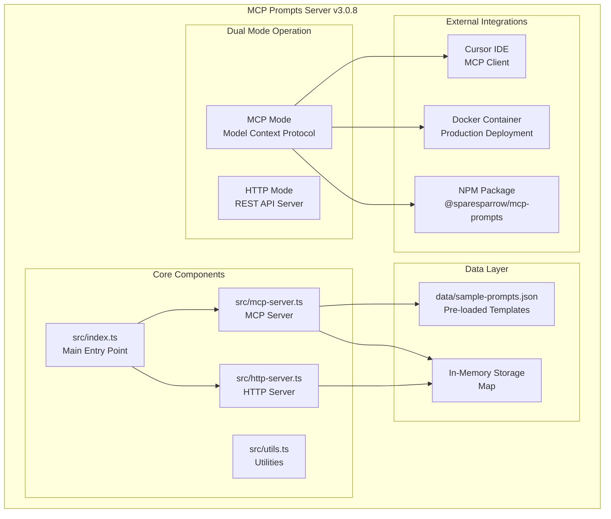
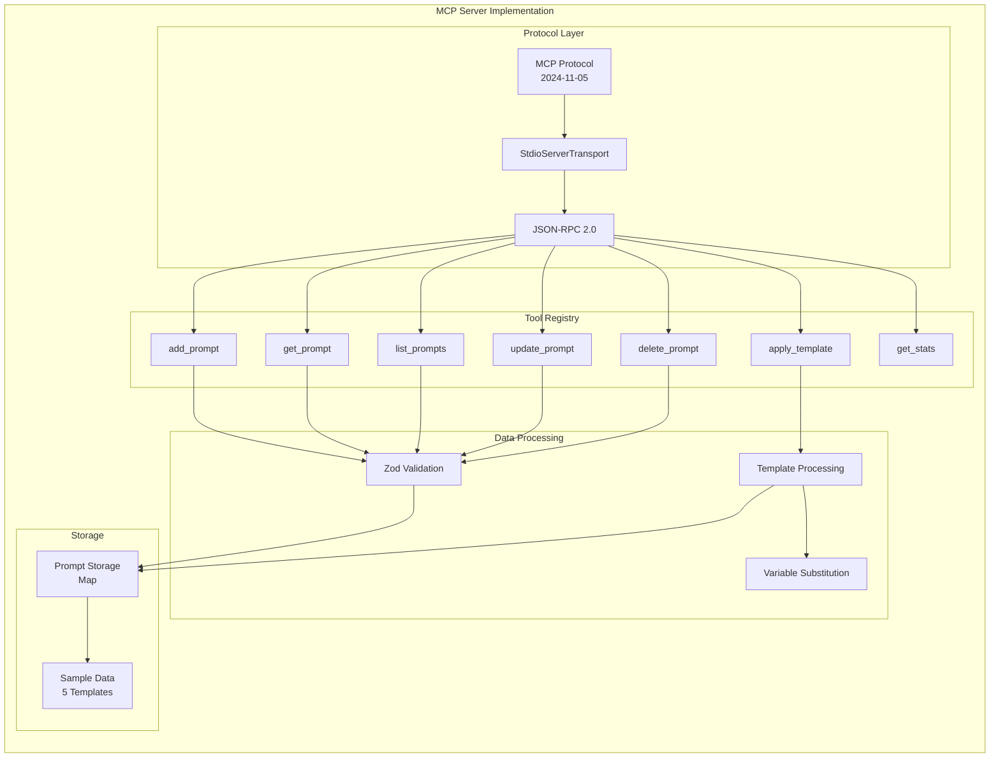
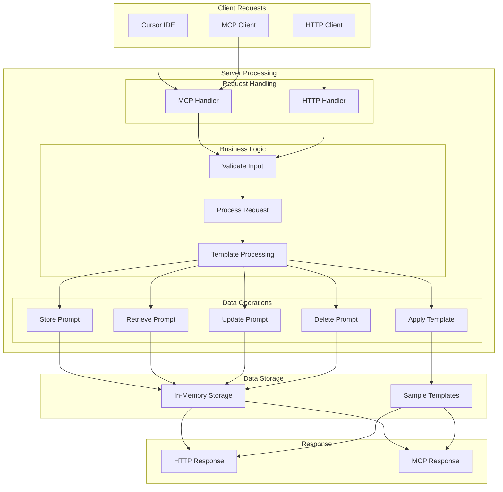
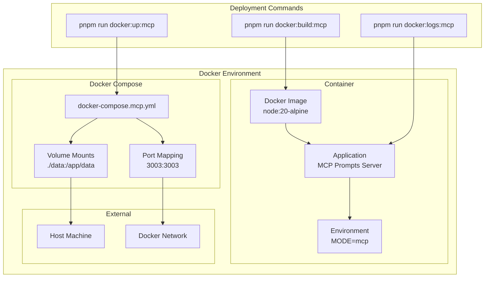
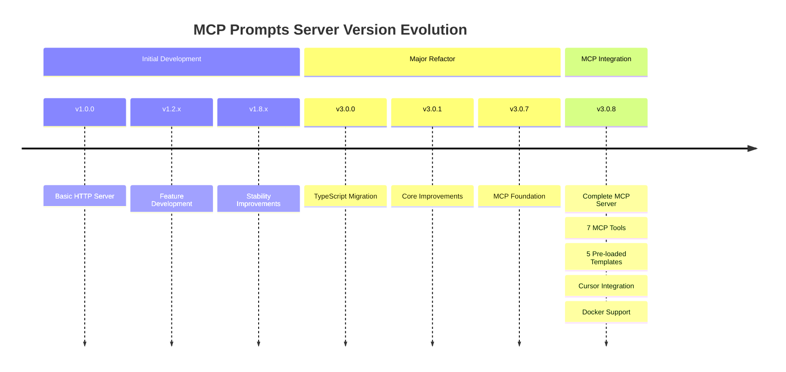
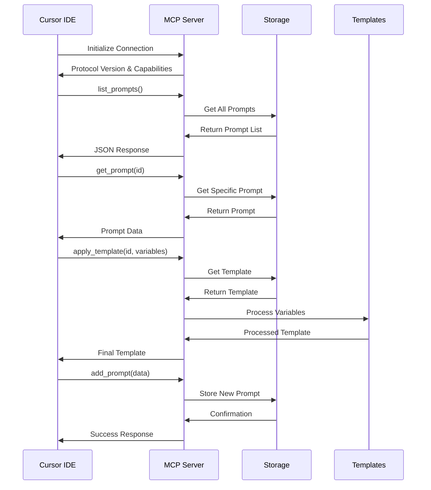
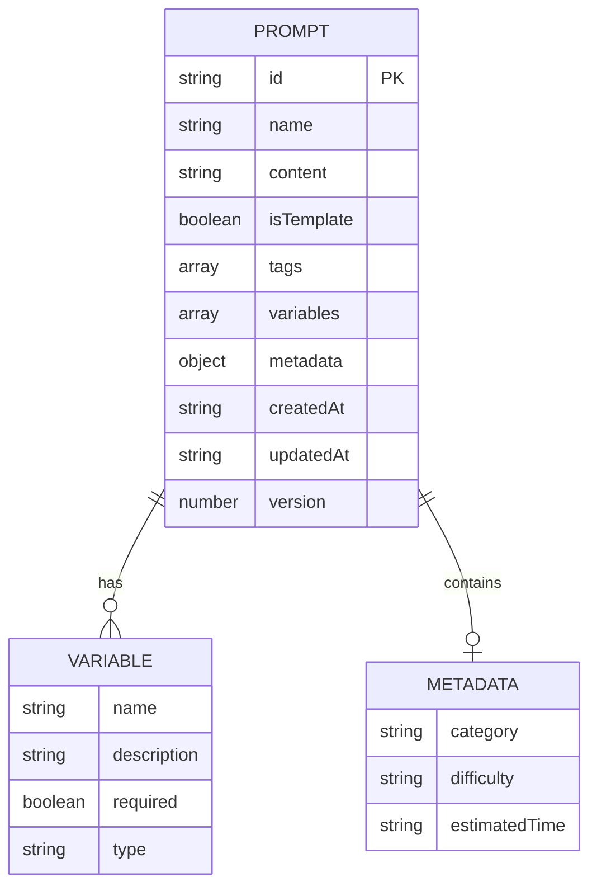
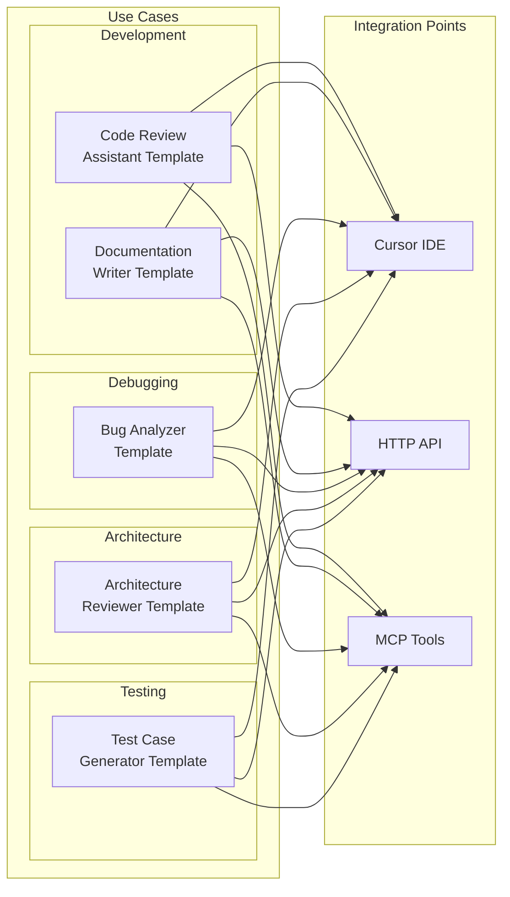

# MCP Prompts Server - Architecture Overview

## 🏗️ System Architecture



## 🔧 MCP Server Architecture



## 📊 Data Flow



## 🔄 Template Processing Flow

```mermaid
flowchart LR
    subgraph "Template Input"
        TEMPLATE[Template with Variables<br/>{{variable}} syntax]
        VARIABLES[Variable Values<br/>JSON object]
    end
    
    subgraph "Processing Steps"
        PARSE[Parse Template]
        EXTRACT[Extract Variables]
        VALIDATE[Validate Variables]
        SUBSTITUTE[Substitute Variables]
    end
    
    subgraph "Output"
        RESULT[Processed Template<br/>Ready for use]
    end
    
    TEMPLATE --> PARSE
    VARIABLES --> EXTRACT
    
    PARSE --> EXTRACT
    EXTRACT --> VALIDATE
    VALIDATE --> SUBSTITUTE
    SUBSTITUTE --> RESULT
```

## 🐳 Docker Deployment



## 📈 Version Evolution



## 🔧 Tool Interaction Flow



## 📊 Data Model



## 🎯 Use Case Scenarios



---

## 📋 Summary

These diagrams provide a comprehensive visual representation of the MCP Prompts Server architecture, demonstrating the "show over tell" approach by visualizing:

1. **System Architecture** - Overall structure and component relationships
2. **MCP Server Implementation** - Detailed MCP protocol integration
3. **Data Flow** - How requests are processed through the system
4. **Template Processing** - Variable substitution workflow
5. **Docker Deployment** - Containerization strategy
6. **Version Evolution** - Project development timeline
7. **Tool Interactions** - MCP tool communication flow
8. **Use Cases** - Real-world application scenarios
9. **Data Model** - Entity relationships and structure

The diagrams make complex architectural decisions and relationships immediately clear through visual representation rather than lengthy textual descriptions.
