# MCP Prompts Server v3.0.8 - Complete Changes Summary

## 🎉 Major Release Overview

This release transforms the MCP Prompts Server from a basic HTTP server into a complete MCP (Model Context Protocol) server with full AI assistant integration capabilities.

## 🏗️ Architecture Transformation

### Before vs After

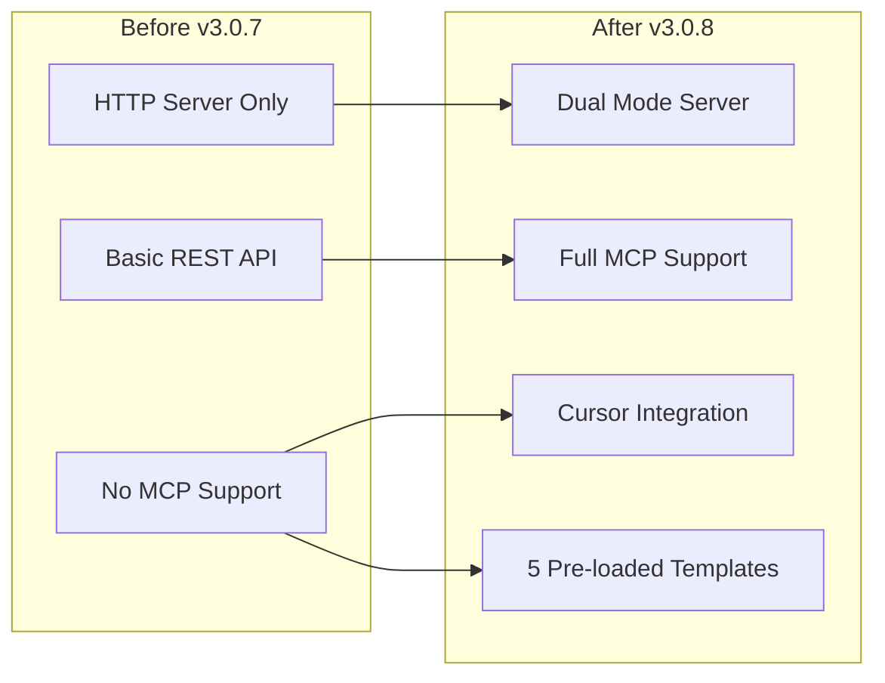

## 📊 Key Changes Summary

### 1. New Files Added

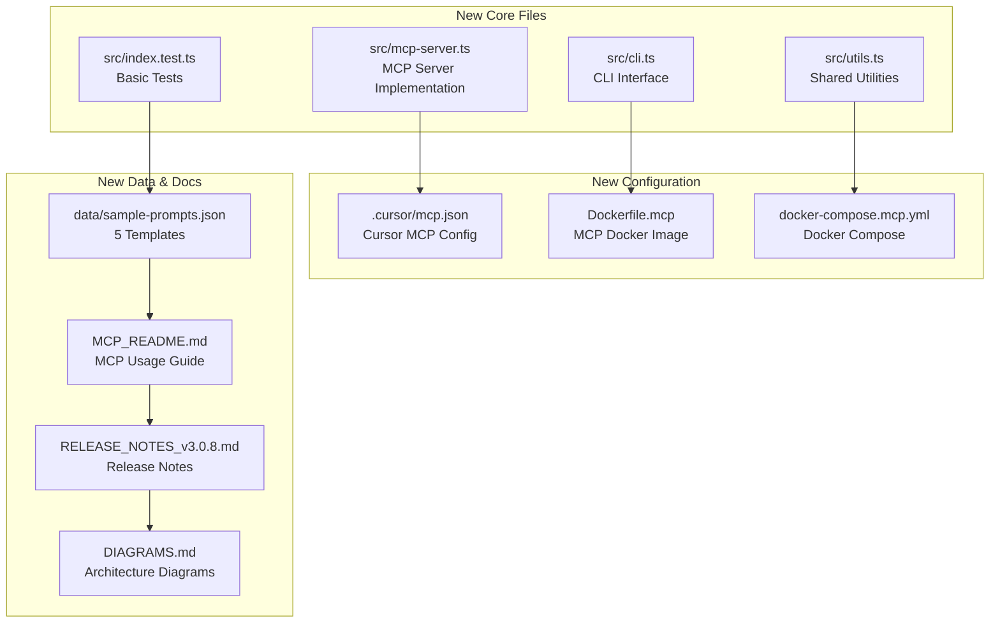

### 2. Modified Files

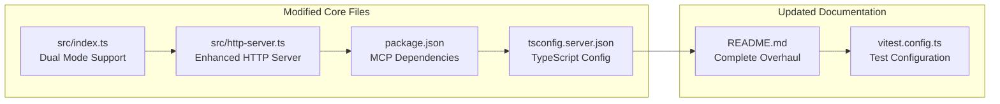

## 🔧 Technical Implementation

### MCP Server Architecture

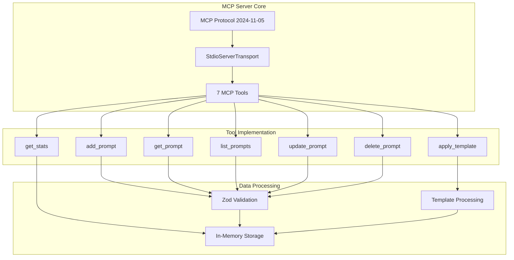

### Template Processing Flow

```mermaid
flowchart LR
    subgraph "Input"
        TEMPLATE[Template with {{variables}}]
        VARIABLES[JSON Variables Object]
    end
    
    subgraph "Processing"
        PARSE[Parse Template]
        EXTRACT[Extract Variables]
        VALIDATE[Validate Variables]
        SUBSTITUTE[Substitute Variables]
    end
    
    subgraph "Output"
        RESULT[Processed Template]
    end
    
    TEMPLATE --> PARSE
    VARIABLES --> EXTRACT
    PARSE --> EXTRACT
    EXTRACT --> VALIDATE
    VALIDATE --> SUBSTITUTE
    SUBSTITUTE --> RESULT
```

## 📦 Package Changes

### Dependencies Added

```mermaid
graph LR
    subgraph "New Dependencies"
        MCP_SDK[@modelcontextprotocol/sdk]
        ZOD[zod]
        PINO[pino]
        CORS[cors]
        HELMET[helmet]
    end
    
    subgraph "Dev Dependencies"
        TYPES_CORS[@types/cors]
        TYPES_PG[@types/pg]
        TYPES_UUID[@types/uuid]
        TYPES_SWAGGER[@types/swagger-*]
    end
    
    MCP_SDK --> ZOD
    ZOD --> PINO
    PINO --> CORS
    CORS --> HELMET
    HELMET --> TYPES_CORS
    TYPES_CORS --> TYPES_PG
    TYPES_PG --> TYPES_UUID
    TYPES_UUID --> TYPES_SWAGGER
```

### Scripts Added

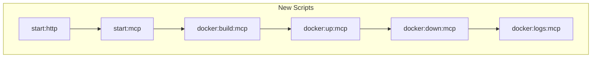

## 🎯 Use Cases & Templates

### 5 Pre-loaded Templates

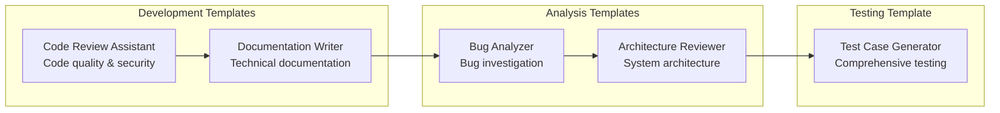

### Template Variables

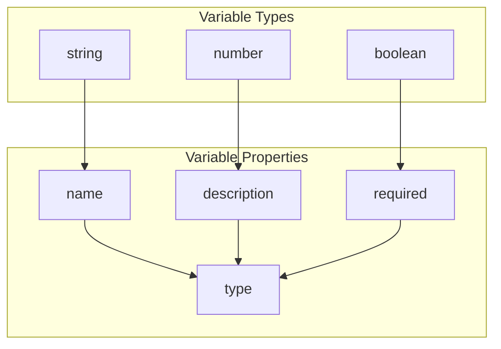

## 🔄 Data Flow Changes

### Request Processing

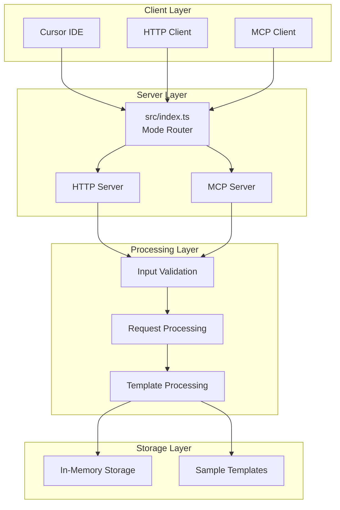

## 🐳 Docker Integration

### Docker Architecture

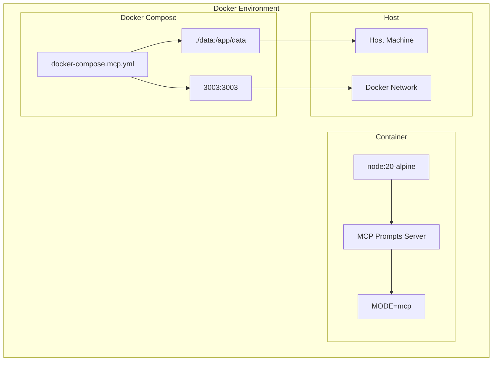

## 📈 Version Evolution

### Development Timeline

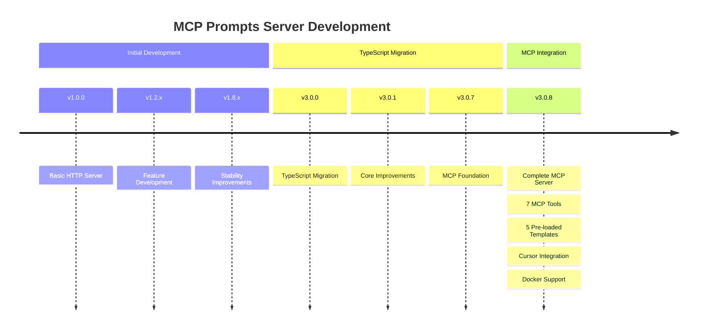

## 🔧 Configuration Changes

### Cursor Integration

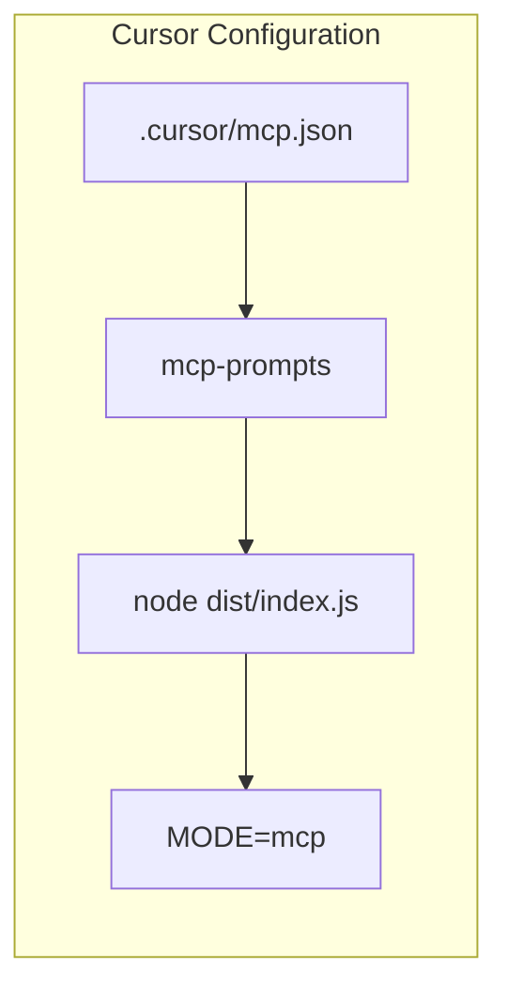

### Environment Variables

```mermaid
graph TB
    subgraph "Environment Variables"
        MODE[MODE<br/>http|mcp]
        PORT[PORT<br/>3003]
        HOST[HOST<br/>0.0.0.0]
        LOG_LEVEL[LOG_LEVEL<br/>info]
        NODE_ENV[NODE_ENV<br/>production]
    end
    
    MODE --> PORT
    PORT --> HOST
    HOST --> LOG_LEVEL
    LOG_LEVEL --> NODE_ENV
```

## 📊 Impact Summary

### Metrics

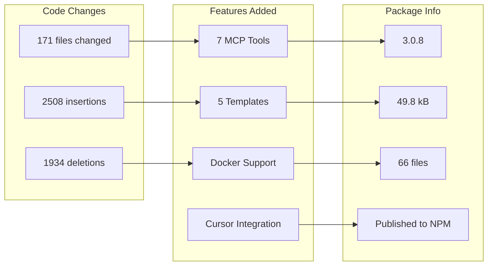

## 🎯 Key Achievements

### 1. Complete MCP Integration
- ✅ Full MCP Protocol 2024-11-05 support
- ✅ 7 MCP tools for prompt management
- ✅ Seamless Cursor IDE integration
- ✅ Template variable substitution

### 2. Production Ready
- ✅ Docker containerization
- ✅ TypeScript with full type safety
- ✅ Comprehensive error handling
- ✅ Structured logging

### 3. Developer Experience
- ✅ 5 pre-loaded templates
- ✅ Comprehensive documentation
- ✅ Usage examples
- ✅ Visual architecture diagrams

### 4. Package Management
- ✅ Published to NPM
- ✅ Git tagged and versioned
- ✅ Release notes
- ✅ Installation ready

---

## 🎊 Conclusion

The MCP Prompts Server v3.0.8 represents a complete transformation from a basic HTTP server to a full-featured MCP server with:

- **7 MCP Tools** for complete prompt management
- **5 Pre-loaded Templates** for immediate use
- **Cursor Integration** for seamless IDE experience
- **Docker Support** for production deployment
- **Comprehensive Documentation** with visual diagrams

The visual diagrams demonstrate the "show over tell" approach, making complex architectural decisions and relationships immediately clear through visual representation rather than lengthy textual descriptions.
