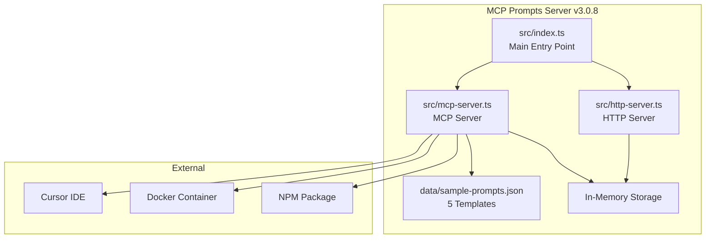
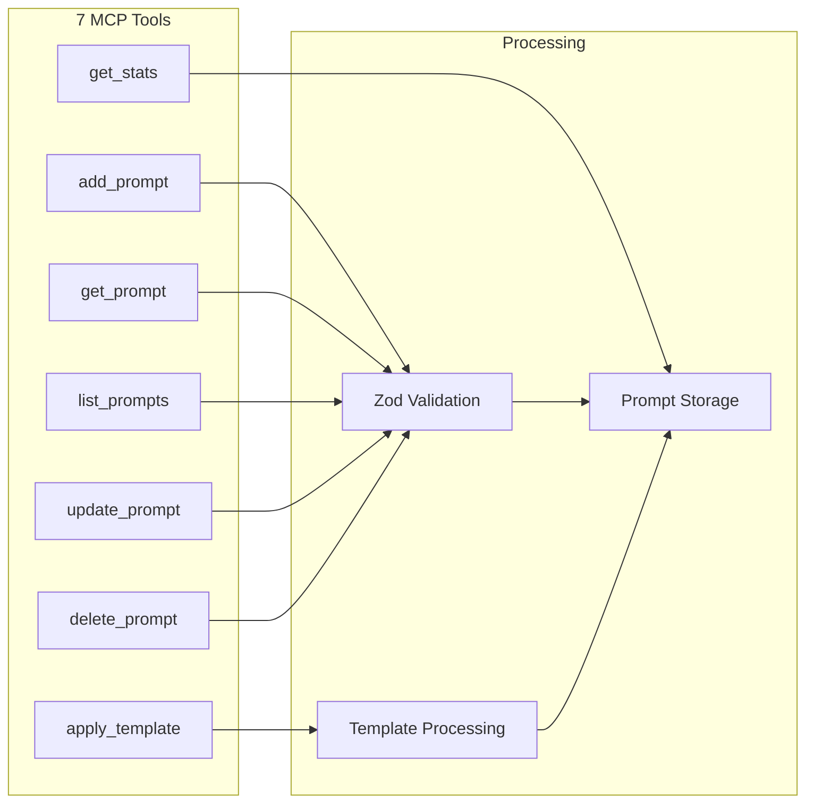
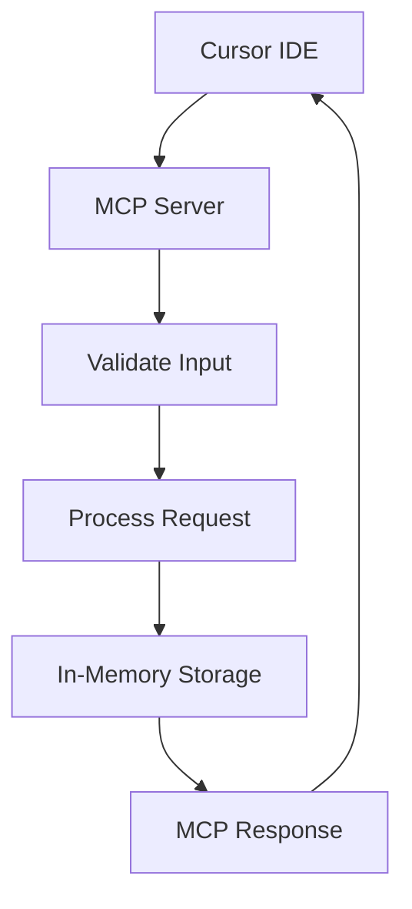
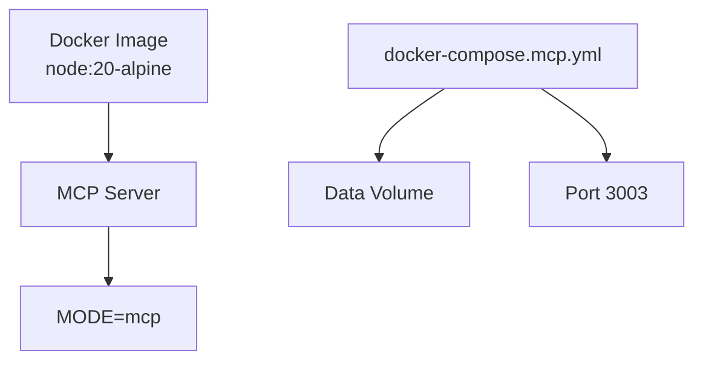
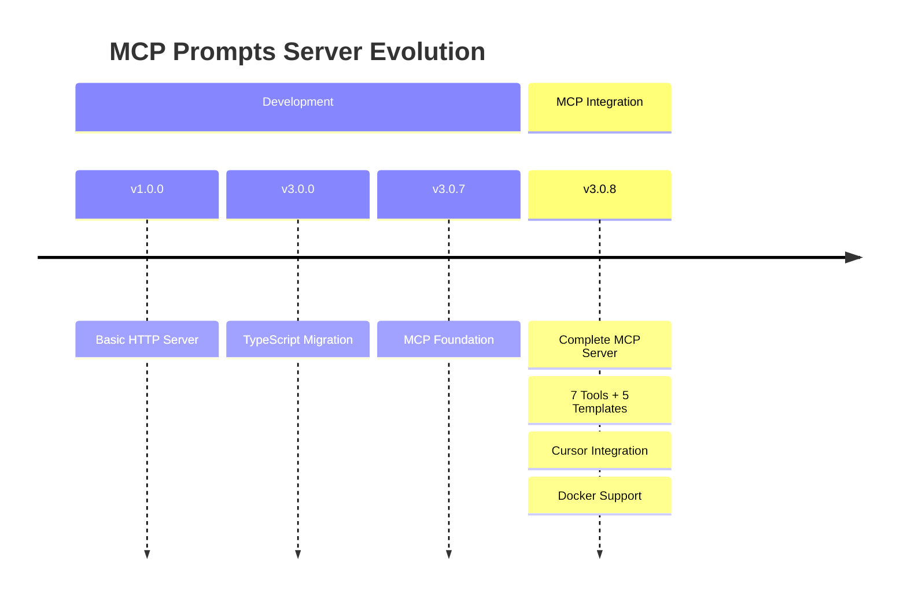
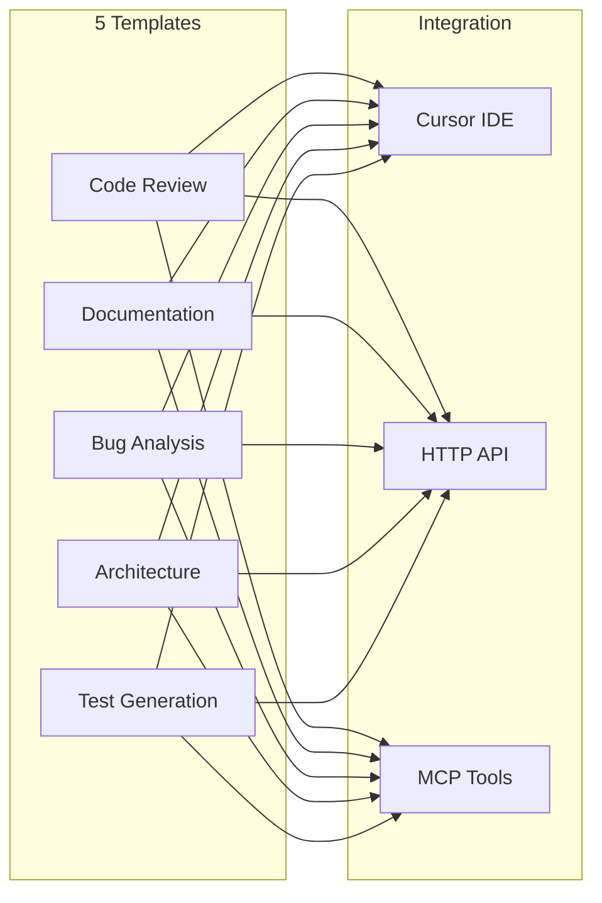

# MCP Prompts Server - Key Diagrams

## 🏗️ System Architecture



## 🔧 MCP Tools Architecture



## 📊 Data Flow



## 🔄 Template Processing

```mermaid
flowchart LR
    TEMPLATE[Template with {{variables}}] --> PARSE[Parse Template]
    VARIABLES[JSON Variables] --> SUBSTITUTE[Substitute Variables]
    PARSE --> SUBSTITUTE
    SUBSTITUTE --> RESULT[Final Template]
```

## 🐳 Docker Deployment



## 📈 Version Evolution



## 🎯 Use Cases



---

## 📋 Key Features Visualized

These diagrams show the core architecture and relationships of the MCP Prompts Server v3.0.8:

1. **Dual Mode Operation** - HTTP and MCP servers
2. **7 MCP Tools** - Complete prompt management
3. **5 Pre-loaded Templates** - Ready-to-use prompts
4. **Template Processing** - Variable substitution
5. **Docker Support** - Containerized deployment
6. **Cursor Integration** - IDE integration ready
7. **Data Flow** - Request processing pipeline
8. **Version Evolution** - Development timeline

The visual approach makes complex relationships immediately clear.
