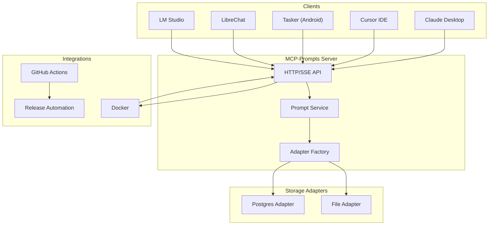
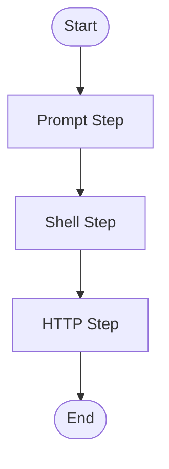

# MCP Prompts Server

[](LICENSE)
[](https://github.com/sparesparrow/mcp-prompts/commits/main)
[](https://github.com/sparesparrow/mcp-prompts/issues)
[](CONTRIBUTING.md)

---

## Table of Contents
- [Key Features](#key-features)
- [Why MCP Prompts?](#why-mcp-prompts)
- [How It Works](#how-it-works)
- [Quick Start](#quick-start)
- [Installation](#installation)
- [Configuration](#configuration)
- [API / Tooling](#api--tooling)
- [Docker Compose](#docker-compose)
- [Architecture Overview](#architecture-overview)
- [Docker Images & Automated Publishing](#docker-images--automated-publishing)
- [Documentation](#documentation)
- [Supported Clients](#supported-clients)
- [How to Contribute](#how-to-contribute)
- [Community Standards](#community-standards)
- [Sustainability](#sustainability)
- [Project Board & Roadmap](#project-board--roadmap)
- [CLI Usage & Troubleshooting](#cli-usage--troubleshooting)
- [FAQ & Troubleshooting](#faq--troubleshooting)
- [Project Philosophy](#project-philosophy)
- [Security Best Practices](#security-best-practices)

---

Model Context Protocol (MCP) Prompts Server is a lightweight, stateless service for storing, retrieving, and templating prompts for large-language-model (LLM) workflows. It's designed to be a centralized hub for prompt management in a multi-tool or multi-agent environment.
It can run stand-alone, inside Docker, or as part of a multi-server MCP stack and already powers AI clients like Claude Desktop.

---

## ✨ Key Features

- **Stateless by Design:** The server itself is stateless, delegating state management to swappable storage backends. This makes it highly scalable and resilient.
- **Extensible Storage:** Choose from multiple storage backends at runtime via a simple environment variable.
  - file: Simple JSON file storage, great for getting started.
  - postgres: Robust PostgreSQL backend for production use.
- **Powerful Templating:** Uses a simple `{{variable}}` syntax for dynamic prompt generation.
- **Real-time with SSE:** Built-in Server-Sent Events (SSE) support for streaming responses, perfect for real-time applications.
- **Full-text and Vector Search:** Leverage PostgreSQL's advanced search capabilities when using the postgres backend.
- **Tagging:** Organize prompts with tags for easy filtering and retrieval.
- **Docker-Ready:** Official Docker images and Docker Compose files for easy deployment.
- **CI/CD Friendly:** Designed for easy integration into automated testing and deployment pipelines.

---

## 🤔 Why MCP Prompts?

In complex LLM workflows, managing prompts can become a major challenge. They might be scattered across different tools, hardcoded in applications, or difficult to update. This server solves that by providing a central, API-driven repository for all your prompts, offering:

- **Centralization:** A single source of truth for all prompts.
- **Decoupling:** Separate your prompt logic from your application code.
- **Reusability:** Easily reuse and share prompts across different projects and tools.
- **Dynamic Content:** Use templates to generate prompts on the fly.

---

## 🏗️ Architecture Overview



---

## 🚀 Quick Start

Run from your terminal using npx:
# One-liner using npx
npx -y @sparesparrow/mcp-prompts

Or use the official Docker image:
docker run -p 3003:3003 -v ~/mcp/data:/app/data sparesparrow/mcp-prompts:latest

Point your MCP-compatible client (like Claude Desktop) to http://localhost:3003 and type / to see the list of available prompts.

---

## 🛠️ Installation
| Method | Command |
|---|---|
| NPX (recommended) | npx -y @sparesparrow/mcp-prompts |
| Global NPM | npm i -g @sparesparrow/mcp-prompts |
| Docker | docker pull sparesparrow/mcp-prompts:latest |

---

## ⚙️ Configuration (Environment Variables)
| Variable | Purpose | Default |
|---|---|---|
| PORT | HTTP port for the server | 3003 |
| LOG_LEVEL | Logging level: error, warn, info, debug | info |
| Storage |  |  |
| STORAGE_TYPE | Storage backend: file, postgres, mdc | file |
| PROMPTS_DIR | Directory for file and mdc storage | ~/mcp/data/prompts |
| PostgreSQL | (Only if STORAGE_TYPE=postgres) |  |
| PG_HOST | PostgreSQL server host | localhost |
| PG_PORT | PostgreSQL server port | 5432 |
| PG_USER | PostgreSQL username | postgres |
| PG_PASSWORD | PostgreSQL password | postgres |
| PG_DATABASE | PostgreSQL database name | mcp |

---

## 📡 API / Tooling
The server exposes a set of tools that can be called via any MCP client or standard HTTP requests.
Example use_mcp_tool call:
use_mcp_tool({
  server_name: "prompt-manager",
  tool_name: "apply_template",
  arguments: {
    id: "dev-system-prompt",
    variables: {
      project_type: "web frontend",
      language: "TypeScript/React"
    }
  }
});

Example curl call:
curl -X POST http://localhost:3003/api/prompts/apply-template \
  -H "Content-Type: application/json" \
  -d '{
        "id": "dev-system-prompt",
        "variables": {
          "project_type": "web frontend",
          "language": "TypeScript/React"
        }
      }'

Available Tools
| Tool | Description | Endpoint | Method |
|---|---|---|---|
| list_prompts | Retrieves a list of all available prompts. | /api/prompts | GET |
| get_prompt | Fetches a single prompt by its ID. | /api/prompts/:id | GET |
| add_prompt | Adds a new prompt. | /api/prompts | POST |
| update_prompt | Updates an existing prompt by ID. | /api/prompts/:id | PUT |
| delete_prompt | Deletes a prompt by ID. | /api/prompts/:id | DELETE |
| apply_template | Applies variables to a prompt template and returns the result. | /api/prompts/apply-template | POST |

---

##  CLI Usage

In addition to the HTTP API, the server provides a command-line interface (CLI) for managing prompts and workflows.

**Syntax:** `npx @sparesparrow/mcp-prompts <command> [options]`

### Workflow Commands

- `mcp-prompts workflow run <file>`: Run a workflow from a file.
- `mcp-prompts workflow save <file>`: Save a workflow to the database.
- `mcp-prompts workflow run <id>`: Run a saved workflow by its ID.

### Workflow Commands

The `workflow` command group allows you to execute and manage complex, multi-step prompt sequences defined in a JSON file.

| Command | Description | Example |
|---|---|---|
| `workflow run <file_or_id>` | Executes a workflow from a local JSON file or by the ID of a saved workflow. | `mcp-prompts workflow run ./examples/sample-workflow.json` |
| `workflow save <file>` | Saves a workflow definition to the server, making it runnable by ID. | `mcp-prompts workflow save ./examples/advanced-workflow-example.json` |

A workflow file defines a series of steps, where each step can call an MCP tool, run a shell command, or perform other actions. This enables powerful automation directly from the command line. For more details, see the [Workflow Guide](docs/09-workflow-guide.md).

---

## 🐋 Docker Compose
For more complex setups, use the provided Docker Compose files.
# Base deployment using file storage
docker compose -f docker/compose/docker-compose.base.yml up -d

# Deployment with a PostgreSQL backend
docker compose -f docker/compose/docker-compose.base.yml \
               -f docker/compose/docker-compose.postgres.yml \
               up -d


> **Quick Reference:** The following Mermaid diagram provides a text-based architecture overview. GitHub now renders Mermaid diagrams natively in Markdown for easy navigation and accessibility.

```mermaid
graph TD
  subgraph Clients
    A1[LM Studio]
    A2[LibreChat]
    A3[Tasker (Android)]
    A4[Cursor IDE]
    A5[Claude Desktop]
  end
  subgraph MCP-Prompts Server
    B1[Prompt Service]
    B2[HTTP/SSE API]
    B3[Adapter Factory]
  end
  subgraph Storage Adapters
    C1[File Adapter]
    C2[Postgres Adapter]
  end
  subgraph Integrations
    D1[Docker]
    D2[GitHub Actions]
    D3[Release Automation]
  end

  A1 --> B2
  A2 --> B2
  A3 --> B2
  A4 --> B2
  A5 --> B2
  B2 --> B1
  B1 --> B3
  B3 --> C1
  B3 --> C2
  B2 --> D1
  D2 --> D3
  D1 --> B2
```

---

# MCP Prompts

A streamlined prompt manager using MCP architecture patterns.

## Features

- ✨ Prompt management with versioning and metadata
- 🔄 Template support with variable substitution
- 📦 Multiple storage adapters (File, PostgreSQL, Memory, MDC, ElasticSearch)
- 🌐 HTTP API with robust security and rate limiting
- 🔌 Server-Sent Events (SSE) for real-time updates
- 🔒 Secure by default with helmet security headers
- 🚦 Rate limiting to prevent abuse
- 🔄 Automatic reconnection for SSE clients
- 🧹 Automatic cleanup of stale connections
- 📝 Comprehensive logging and error handling

## Installation

```bash
npm install mcp-prompts
```

## Quick Start

```typescript
import { startServer } from 'mcp-prompts';

const server = await startServer({
  port: 3003,
  storageType: 'file',
  promptsDir: './prompts',
  enableSSE: true
});
```

## Configuration

The server supports various configuration options:

```typescript
interface ServerConfig {
  // Server settings
  port: number;
  host: string;
  name: string;
  version: string;

  // Storage settings
  storageType: 'file' | 'postgres' | 'memory' | 'mdc' | 'elasticsearch';
  promptsDir: string;
  backupsDir: string;

  // HTTP settings
  httpServer: boolean;
  corsOrigin?: string;
  
  // Rate limiting
  rateLimit?: {
    windowMs: number; // Default: 15 minutes
    max: number;      // Default: 100 requests per windowMs
  };

  // SSE settings
  enableSSE?: boolean;
  ssePath?: string;
  
  // PostgreSQL settings (if using postgres storage)
  postgres?: {
    host: string;
    port: number;
    database: string;
    user: string;
    password: string;
  };

  // ElasticSearch settings (if using elasticsearch storage)
  elasticsearch?: {
    node: string;
    auth?: {
      username: string;
      password: string;
    };
    index?: string;
    sequenceIndex?: string;
  };
}
```

## HTTP API

The server provides a RESTful HTTP API with the following endpoints:

### Prompts

- `POST /prompts` - Create a new prompt
- `GET /prompts/:id` - Get a prompt by ID
- `PUT /prompts/:id` - Update a prompt
- `DELETE /prompts/:id` - Delete a prompt
- `GET /prompts` - List all prompts

### Templates

- `POST /templates` - Create a new template
- `GET /templates/:id` - Get a template by ID
- `PUT /templates/:id` - Update a template
- `DELETE /templates/:id` - Delete a template
- `POST /templates/:id/apply` - Apply a template with variables

### Server-Sent Events

The SSE implementation provides real-time updates with:

- Automatic reconnection with exponential backoff
- Message history for missed updates
- Heartbeat to detect stale connections
- Proper cleanup of disconnected clients

To connect to the SSE stream:

```javascript
const sse = new EventSource('/events');

sse.onmessage = (event) => {
  const data = JSON.parse(event.data);
  console.log('Received:', data);
};

sse.onerror = (error) => {
  console.error('SSE error:', error);
};
```

## Security

The server implements several security measures:

- Helmet security headers
- Rate limiting
- CORS configuration
- Request size limits
- Input validation
- Error handling
- **Shell Step Sandboxing:**
  - For workflow steps of type `shell`, you can enable Docker-based sandboxing by setting the `SHELL_SANDBOX_IMAGE` environment variable (e.g., `SHELL_SANDBOX_IMAGE=ubuntu`).
  - When set, shell commands are executed inside a Docker container using the specified image, providing isolation and improved security.
  - If not set, shell commands run directly on the host (unsafe for production; a warning will be logged).
  - Example:
    ```bash
    SHELL_SANDBOX_IMAGE=ubuntu npx -y @sparesparrow/mcp-prompts
    ```
  - This is the recommended way to run shell steps securely in production environments.

## Contributing

Please read our [Contributing Guide](CONTRIBUTING.md) for details on our code of conduct and the process for submitting pull requests.

## License

This project is licensed under the MIT License - see the [LICENSE](LICENSE) file for details.

## Show your support

If you find MCP-Prompts useful, please consider supporting the project:

- [GitHub Sponsors](https://github.com/sponsors/sparesparrow) – Help fund ongoing development and maintenance.
- Star the repository and share it with your network!

## Roadmap

- [x] HTTP API with security features
- [x] SSE support with reconnection
- [x] Multiple storage adapters
- [x] Template support
- [x] ElasticSearch adapter
- [x] Orchestrator integration
- [x] Mermaid diagram server

## Support

For support, please open an issue in the GitHub repository or join our Discord community.

# MCP Prompts Server

[](https://github.com/sparesparrow/mcp-prompts/actions)
[](https://codecov.io/gh/sparesparrow/mcp-prompts)
[](https://www.npmjs.com/package/@sparesparrow/mcp-prompts)
[](LICENSE)


A lightweight, extensible server for managing prompts and templates in the Model Context Protocol (MCP) ecosystem. **Store prompts once, version them, and retrieve them on demand.**

---

## Why MCP-Prompts?

* 🔌 **Pluggable storage** – file-system, PostgreSQL, MDC (Cursor Rules), and more coming.
* 🧩 **Composable** – expose prompts as MCP resources or HTTP/SSE endpoints.
* 🚀 **Instant setup** – run locally with _npx_ or in the cloud with Docker.
* 🛠️ **Dev-friendly** – JSON schema validation, typed SDK, comprehensive tests.
* 📜 **Open licence & community focused** – contributions welcome!

---

## 30-Second Quick-Start

### 1. Using npx (no dependencies)
```bash
npx -y @sparesparrow/mcp-prompts
curl http://localhost:3003/health   # → { "status": "ok" }
```

### 2. Using Docker (persistent volume)
```bash
docker run -d --name mcp-prompts \
  -p 3003:3003 \
  -e HTTP_SERVER=true \
  -e STORAGE_TYPE=file \
  -v $(pwd)/data:/app/data \
  sparesparrow/mcp-prompts:latest
```

### 3. Docker Compose (PostgreSQL + ElevenLabs)
Create a `docker-compose.yml` file:
```yaml
version: "3.8"
services:
  prompts:
    image: sparesparrow/mcp-prompts:latest
    environment:
      HTTP_SERVER: "true"
      STORAGE_TYPE: "postgres"
      POSTGRES_CONNECTION_STRING: "postgresql://postgres:password@db:5432/mcp_prompts"
      ELEVENLABS_API_KEY: "${ELEVENLABS_API_KEY}"
      ELEVENLABS_MODEL: "eleven_multilingual_v2"
      ELEVENLABS_VOICE_ID: "21m00Tcm4TlvDq8ikWAM"  # Default voice
      ELEVENLABS_STABILITY: "0.75"  # Higher stability for better quality
      ELEVENLABS_SIMILARITY: "0.85"  # Higher voice similarity
      ELEVENLABS_STYLE: "1.0"  # Maximum style injection
      ELEVENLABS_SPEAKER_BOOST: "true"  # Enable speaker boost
      ELEVENLABS_CHUNK_LENGTH: "200"  # Optimal chunk size for cost/quality
      ELEVENLABS_CACHE_DIR: "/app/cache/audio"  # Cache generated audio
    ports: [ "3003:3003" ]
    volumes:
      - audio_cache:/app/cache/audio
    depends_on: [ db ]
  db:
    image: postgres:14
    environment:
      POSTGRES_USER: postgres
      POSTGRES_PASSWORD: password
    volumes:
      - postgres_data:/var/lib/postgresql/data

volumes:
  audio_cache:
  postgres_data:
```
Then run:
```bash
docker compose up -d
curl http://localhost:3003/health
```

---

## Docker Images & Automated Publishing

Docker images for MCP-Prompts are automatically built and published to the GitHub Container Registry (GHCR) on every push to `main` and on every version tag (e.g., `v1.2.3`).

- **Registry:** `ghcr.io/sparesparrow/mcp-prompts`
- **Tags:** `latest`, or a specific version (e.g., `v1.2.43`)

### Pull the Latest Image
```bash
docker pull ghcr.io/sparesparrow/mcp-prompts:latest
```

### Pull a Specific Version
```bash
docker pull ghcr.io/sparesparrow/mcp-prompts:v1.2.43
```

These images are built and signed automatically by [GitHub Actions](.github/workflows/docker-publish.yml) on every release.

> **Note:** If you need Docker Hub support, open an issue or PR. The workflow can be extended to push to Docker Hub as well.

### Release Notes Automation

Release notes for every GitHub release are now **automatically generated and categorized** using [release.yml](.github/release.yml). Categories include Features, Bugfixes, Dependencies, and Other Changes. You can customize these categories by editing `.github/release.yml`.

For more details and advanced configuration, see the [GitHub Docs: Automatically generated release notes](https://docs.github.com/en/repositories/releasing-projects-on-github/automatically-generated-release-notes).

---

## Implemented vs Planned Features

| Feature | Status | Notes |
| --- | :---: | --- |
| File storage adapter | ✅ | stable |
| Memory storage adapter | ✅ | stable, for testing/dev |
| PostgreSQL adapter (+ embeddings) | ✅ | since v1.2.x |
| MDC adapter (Cursor Rules) | ✅ | stable, fully tested |
| HTTP server + SSE | ✅ | stable, with compression |
| ElasticSearch adapter | ✅ | since v1.3.x |
| Orchestrator integration | ✅ | basic workflow tool & endpoint |
| Mermaid diagram server | ✅ | basic HTTP endpoint |

Legend: ✅ stable · ⚠️ experimental · 🛠️ in progress

---

## Documentation

This README is intentionally concise. Full documentation lives in the `docs/` directory, and each key directory (`scripts/`, `docker/scripts/`, `legacy/`, `examples/`) contains a README for navigation and usage details.

> **See also:** Links to official MCP documentation and community resources are provided below.

| Path | What you will find there |
| --- | --- |
| `docs/00-overview.md` | Detailed project overview & motivation |
| `docs/01-quickstart.md` | The same quick-start plus advanced tips |
| `docs/02-configuration.md` | All environment variables & CLI flags |
| `docs/03-storage-adapters.md` | File, Postgres, MDC, and upcoming adapters |
| `docs/04-api-reference.md` | Tool & HTTP API reference (WIP) |
| `docs/05-templates-guide.md` | Variables, apply, export, best practices |
| `docs/06-mcp-integration.md` | Multi-server scenarios, router, SSE |
| `docs/07-developer-guide.md` | Contributing, tests, release process |
| `docs/08-roadmap.md` | Planned features & milestones |

> ℹ️ Legacy content from the previous long README has been preserved at `docs/LEGACY_README.md` until the migration is complete.

> **New:** See [examples/advanced-workflow-example.json](./examples/advanced-workflow-example.json) and the expanded [Templates Guide](./docs/05-templates-guide.md) for advanced prompt chaining and workflow usage.

> **Validation:** Prompts are now validated for required fields, duplicate IDs, variable consistency, and content format. See [src/prompt-service.ts](./src/prompt-service.ts) for details.
> **Testing:** The MDC (Cursor Rules) adapter is now covered by integration tests. See [tests/integration/mdc-adapter.integration.test.ts](./tests/integration/mdc-adapter.integration.test.ts).

---

## Official MCP Documentation & Community Resources

- [Model Context Protocol (MCP) – Official Docs](https://modelcontextprotocol.org/)
- [MCP GitHub Organization](https://github.com/modelcontextprotocol)
- [Cursor IDE – Model Context Protocol](https://docs.cursor.com/context/model-context-protocol)
- [MCP Community Discussions](https://github.com/orgs/community/discussions)
- [GitHub Actions Starter Workflows (for workflow inspiration)](https://github.com/actions/starter-workflows)

---

## User Guides

- [How to use MCP-Prompts with Claude Desktop, Cursor IDE, LM Studio, LibreChat, and Tasker (English)](./USER_GUIDE.md)
- [Jak používat MCP-Prompts s Claude Desktop, Cursor IDE, LM Studio, LibreChat a Taskerem (česky)](./USER_GUIDE-cs.md)

> **Note:** User guides are now fully expanded for all major clients, including step-by-step setup, troubleshooting, and quick reference checklists. See the guides above for details.

---

## Supported Clients

MCP-Prompts works with the following clients:

- **LM Studio** – [Setup Guide](#)
- **LibreChat** – [Setup Guide](#)
- **Tasker (Android)** – [Setup Guide](#)
- **Cursor IDE** – [Setup Guide](#)
- **Claude Desktop** – [Setup Guide](#)

See the [examples/](./examples/) directory for configuration snippets.

---

## How to Contribute

We welcome contributions! Please see [CONTRIBUTING.md](./CONTRIBUTING.md) for guidelines, or open an issue if you have questions or suggestions.

- Fork the repo and create a feature branch
- Run `npm install` and `npm test` to ensure all tests pass
- Submit a pull request with a clear description

---

## Community Standards

We are committed to a welcoming, inclusive, and safe community for all contributors.

- Please read our [Contributing Guide](./CONTRIBUTING.md) before opening issues or pull requests.
- All contributors and participants are expected to follow our [Code of Conduct](./CODE_OF_CONDUCT.md).
- Security issues should be reported privately as described in our [Security Policy](./SECURITY.md).
- We use [issue templates](./.github/ISSUE_TEMPLATE/) and a [pull request template](./.github/pull_request_template.md) to help you provide actionable, high-quality contributions.

---

## Sustainability

MCP-Prompts is committed to long-term sustainability as both a technical project and a community resource. Our approach includes:

- **Ongoing Maintenance:**
  - Regular updates, bug fixes, and compatibility with new MCP standards and client versions.
  - Maintenance costs are minimized through automation and community contributions.

- **Community Engagement:**
  - Open to contributors of all backgrounds, with clear onboarding, good first issues, and public discussions.
  - Recognition for contributors and transparent decision-making.

- **Funding and Support:**
  - Free and open source for all users.
  - We welcome sponsorships (e.g., GitHub Sponsors, OpenCollective), grants, and paid support contracts for organizations relying on MCP-Prompts.

- **Infrastructure:**
  - Designed for easy deployment, maintenance, and extension.
  - Robust CI/CD, automated testing, and clear documentation reduce the maintenance burden.

- **Pathways for Growth:**
  - As the project grows, we will expand the maintainer team, explore partnerships, and consider optional paid services or consulting (while keeping the core open source).

**We invite all users and organizations who benefit from MCP-Prompts to contribute code, documentation, funding, or feedback to help ensure its long-term sustainability.**

---

## License

Distributed under the MIT license. See `LICENSE` for more information.

## Project Board & Roadmap

We use a [GitHub Project board](https://github.com/sparesparrow/mcp-prompts/projects) to track issues, features, and roadmap items.
- See what's planned, in progress, and completed.
- Suggest new features or improvements by opening an issue or discussion.

**Contributors:** Please check the board for tasks marked "help wanted" or "good first issue"!

## Project Board Workflow

Our [GitHub Project board](https://github.com/sparesparrow/mcp-prompts/projects) is the central place for tracking issues, features, and roadmap items.

### How it works

- **Automations:**  
  - Issues and PRs with key labels (e.g., `bug`, `enhancement`, `help wanted`) are automatically added to the board.
  - New items are set to the `Todo` status.
  - Cards move automatically when PRs are merged or issues are closed.

- **Columns:**  
  - **Backlog:** Ideas and tasks not yet started.
  - **Todo:** Ready to be picked up.
  - **In Progress:** Actively being worked on.
  - **Review:** Awaiting code review or testing.
  - **Done:** Completed and merged/closed.

### Contributor Guidelines

- **Pick up tasks:**  
  - Look for cards in `Todo` or `Backlog` with the `help wanted` or `good first issue` label.
  - Move the card to `In Progress` when you start work.
  - Move to `Review` when you open a pull request.
  - Move to `Done` when your work is merged or the issue is closed.

- **Use labels:**  
  - Apply relevant labels when opening issues or PRs to help with triage and automation.

- **Task lists:**  
  - For large features, use checklists in issues to break down work into smaller steps.

For more details, see [GitHub Docs: Creating a project](https://docs.github.com/en/issues/planning-and-tracking-with-projects/creating-projects/creating-a-project) and [Quickstart for Projects](https://docs.github.com/en/issues/planning-and-tracking-with-projects/learning-about-projects/quickstart-for-projects).

# ✅ Android Implementation

A complete, two-phase implementation for deploying the MCP server environment on the Android platform has been scaffolded and is now located in the `android_app/` directory. This implementation provides a powerful, self-contained mobile workflow, evolving from a robust hybrid model to a fully native, high-performance solution. See `android_app/docs/android-deployment-strategy.md` for the full architectural analysis.

## Phase 1: Hybrid API-Client (Localhost Server) MVP

This phase focuses on delivering a functional and high-quality application quickly by bundling the existing Rust server with a native Android UI.

- [x] **Build & Toolchain Setup**
  - [x] Configure `rustup` with Android targets (`aarch64-linux-android`, `x86_64-linux-android`).
  - [x] Integrate `cargo-ndk` for cross-compiling the `mcp-prompts-rs` binary for Android ABIs.
- [x] **Application Packaging**
  - [x] Bundle the cross-compiled `mcp-prompts-rs` executable into the Android app's `jniLibs` directory.
- [x] **Native Android Shell**
  - [x] Develop a native Android UI using Kotlin/Java.
  - [x] Implement an HTTP client (e.g., OkHttp, Ktor) for communication with the local server.
- [x] **Background Service Management**
  - [x] Create an Android `Service` to manage the lifecycle of the bundled Rust binary.
    - [x] Logic to copy the binary to an executable directory.
    - [x] Logic to launch, monitor, and restart the server process.
  - [x] Implement the service as a `Foreground Service` with a persistent notification to ensure reliability and prevent termination by the OS.
- [x] **Security**
  - [x] Implement API key management using the Android `Keystore` system to securely store credentials like `ANTHROPIC_API_KEY`.

## Phase 2: Migration to Native Systems Integration (AIDL)

This phase evolves the architecture to achieve maximum performance, battery efficiency, and deep system integration by replacing the HTTP-based communication with Android's native IPC mechanism.

- [x] **Core Logic Refactoring**
  - [x] Refactor the `mcp-prompts-rs` server from a standalone binary into a reusable Rust library crate, separating logic from the web server.
- [x] **Native IPC Interface Definition**
  - [x] Define a stable service contract using the Android Interface Definition Language (AIDL) in an `IMcpService.aidl` file.
  - [x] Configure the build system (Gradle/`cargo`) to compile the AIDL file into a Rust interface crate.
- [x] **Native Service Implementation**
  - [x] Create a new Rust crate that implements the AIDL-generated service trait.
  - [x] Compile the Rust service implementation into a native shared library (`.so` file).
  - [x] Modify the Android `Service` to load the `.so` library and host the Binder-based service.
- [x] **Client Migration**
  - [x] Update the Android UI client to connect to the service using `bindService()`.
  - [x] Replace the HTTP client implementation with a Binder client to communicate with the native Rust service via the AIDL interface.
- [x] **Future Extensions**
  - [x] Explore exposing the AIDL service to other trusted applications on the device, transforming it into a shared platform component.
  - [x] Integrate capabilities from other MCP ecosystem projects (`mcp-router`, `mcp-project-orchestrator`) into the native service.

---

## Using the MDC (Cursor Rules) Adapter

To use the MDC adapter for storage:

```
STORAGE_TYPE=mdc
MDC_RULES_DIR=./.cursor/rules
```

Or with Docker:

```
docker run -d --name mcp-prompts \
  -p 3003:3003 \
  -e HTTP_SERVER=true \
  -e STORAGE_TYPE=mdc \
  -e MDC_RULES_DIR=/.cursor/rules \
  -v $(pwd)/.cursor/rules:/.cursor/rules \
  sparesparrow/mcp-prompts:latest
```

See `docs/03-storage-adapters.md` for details.

---

## CLI Usage & Troubleshooting

You can run MCP-Prompts via npx, Docker, or as a Node.js package. For full CLI options, troubleshooting, and advanced usage, see the [User Guide](./USER_GUIDE.md).

Common commands:
```bash
npx -y @sparesparrow/mcp-prompts --help
npm run test:unit
npm run test:integration
```

If you encounter issues, see the FAQ & Troubleshooting section below or open an issue on GitHub.

---

## Roadmap & Quality Improvements

All major features and integrations are now implemented and tested. Remaining roadmap items are tracked as GitHub issues. Experimental features are marked as such in the table below.

| Feature | Status | Notes |
| --- | :---: | --- |
| File storage adapter | ✅ | stable |
| Memory storage adapter | ✅ | stable, for testing/dev |
| PostgreSQL adapter (+ embeddings) | ✅ | since v1.2.x |
| MDC adapter (Cursor Rules) | ✅ | stable, fully tested |
| HTTP server + SSE | ✅ | stable, with compression |
| ElasticSearch adapter | ✅ | since v1.3.x |
| Orchestrator integration | ✅ | basic workflow tool & endpoint |
| Mermaid diagram server | ✅ | basic HTTP endpoint |

Legend: ✅ stable · ⚠️ experimental · 🛠️ in progress

---

## FAQ & Troubleshooting

**Q: The server starts but I can't access it at http://localhost:3003/health.**
A: Make sure the server is running, the port is not blocked by a firewall, and you are using the correct address. If running in Docker, check port mappings and container status.

**Q: Prompts are not showing up in my client (e.g., Cursor IDE, Claude Desktop, LM Studio).**
A: Double-check the client configuration (server URL, port, and protocol). Ensure MCP-Prompts is running and accessible from the client machine. See the [User Guides](./USER_GUIDE.md) for step-by-step setup.

**Q: How do I add or update environment variables?**
A: You can set environment variables in your shell, `.env` file, or Docker Compose file. See [docs/02-configuration.md](./docs/02-configuration.md) for all supported variables and their defaults.

**Q: How do I chain prompts or create multi-step workflows?**
A: Use templates with variables and reference outputs between steps. See [examples/advanced-workflow-example.json](./examples/advanced-workflow-example.json) and the [Templates Guide](./docs/05-templates-guide.md) for details.

**Q: I get ESM/TypeScript errors when running tests.**
A: Use the provided npm scripts (e.g., `npm run test:unit`) and ensure all imports use explicit `.js` extensions. See the ESM/TypeScript/Jest notes in this README.

**Q: Where can I find more help or report issues?**
A: Check the [User Guides](./USER_GUIDE.md), [docs/](./docs/) directory, or open an issue on [GitHub](https://github.com/sparesparrow/mcp-prompts/issues).

**Q: What does an error response from the API look like?**
A: All HTTP API errors are returned in a standardized JSON format with clear error codes and messages. See [docs/04-api-reference.md](./docs/04-api-reference.md#error-handling-and-response-format) for details and examples.

---

## Orchestrator Integration

The orchestrator feature allows you to define and execute simple workflows (sequences of prompt/template applications) via MCP tool or HTTP endpoint.

- **MCP Tool:** `orchestrate` — Accepts a list of steps (prompt IDs and variables) and returns the results of applying each step in order.
- **HTTP Endpoint:** `POST /orchestrator` — Accepts `{ steps: [{ promptId, variables }] }` and returns the results.

## Mermaid Diagram Server

The Mermaid diagram server provides a simple HTTP endpoint to visualize prompt relationships as Mermaid diagrams.

- **HTTP Endpoint:** `POST /diagram` — Accepts `{ promptIds: [id1, id2, ...] }` and returns a Mermaid diagram string representing a linear flow of the prompts.

--- 

## Workflow Engine: Visual Execution Flow



For a full guide, see [docs/09-workflow-guide.md](./docs/09-workflow-guide.md).

---

## CLI Usage: Workflow Engine

You can run and manage workflows from the command line:

```
# Run a workflow from a JSON file (ad-hoc)
npm run workflow:run:file -- <file.json>

# Save a workflow from a JSON file
npm run workflow:save:file -- <file.json>

# Run a saved workflow by ID
npm run workflow:run:id -- <workflow-id>
```

> **Note:** If you run multiple workflows in parallel (e.g., from different terminals or users), you may hit the per-user concurrency limit (default 3). If so, you'll receive a 429 error. All workflow runs are logged to `logs/workflow-audit.log` for auditing and troubleshooting.

Set the `MCP_PROMPTS_API_URL` environment variable to override the API URL (default: http://localhost:3003).

---

## Workflow Engine Improvements

### Configurable Concurrency Limit

You can now control the maximum number of concurrent workflows per user with the environment variable:

```
WORKFLOW_MAX_CONCURRENT=5
```
(Default is 3)

### HTTP Step: Headers and Basic Auth

HTTP workflow steps now support custom headers and basic authentication. Example step:

```json
{
  "id": "http1",
  "type": "http",
  "method": "POST",
  "url": "https://api.example.com/endpoint",
  "headers": {
    "Authorization": "Bearer ...",
    "X-Custom": "value"
  },
  "auth": {
    "username": "user",
    "password": "pass"
  },
  "body": { "foo": "bar" },
  "output": "result"
}
```

### Persistent Workflow Storage

Workflows are now stored as JSON files in `data/workflows/`. This replaces the previous in-memory storage. You can back up or edit workflows by managing these files directly.

---

## Security Best Practices

### CORS Configuration
- By default, the server allows all origins (`*`) for CORS. **This is insecure for production.**
- Set the `corsOrigin` config or `CORS_ORIGIN` environment variable to your trusted frontend domain(s) in production.
- Example (in `.env` or config):
  ```
  CORS_ORIGIN=https://your-frontend.example.com
  ```
- Allowing `*` means any website can make requests to your API as the user.

### Rate Limiting
- Global rate limiting is enabled (default: 100 requests per 15 minutes per IP).
- You can configure this via the `rateLimit` config or environment variables.
- For sensitive endpoints (e.g., workflow execution), consider adding stricter, per-user or per-endpoint limits.

### Security Headers
- The server uses `helmet` to set strong HTTP security headers (CSP, HSTS, frameguard, etc.).
- You can customize these in `src/http-server.ts` if needed.

### Error Handling
- In production, ensure error responses do not leak stack traces or sensitive information.
- Review error handling middleware and logging for information leakage.

### Shell Step Sandboxing
- For workflow steps of type `shell`, you can enable Docker-based sandboxing by setting the `SHELL_SANDBOX_IMAGE` environment variable (e.g., `SHELL_SANDBOX_IMAGE=ubuntu`).
- When set, shell commands are executed inside a Docker container using the specified image, providing isolation and improved security.
- If not set, shell commands run directly on the host (unsafe for production; a warning will be logged).
- Example:
  ```bash
  SHELL_SANDBOX_IMAGE=ubuntu npx -y @sparesparrow/mcp-prompts
  ```
- This is the recommended way to run shell steps securely in production environments.

--- 
