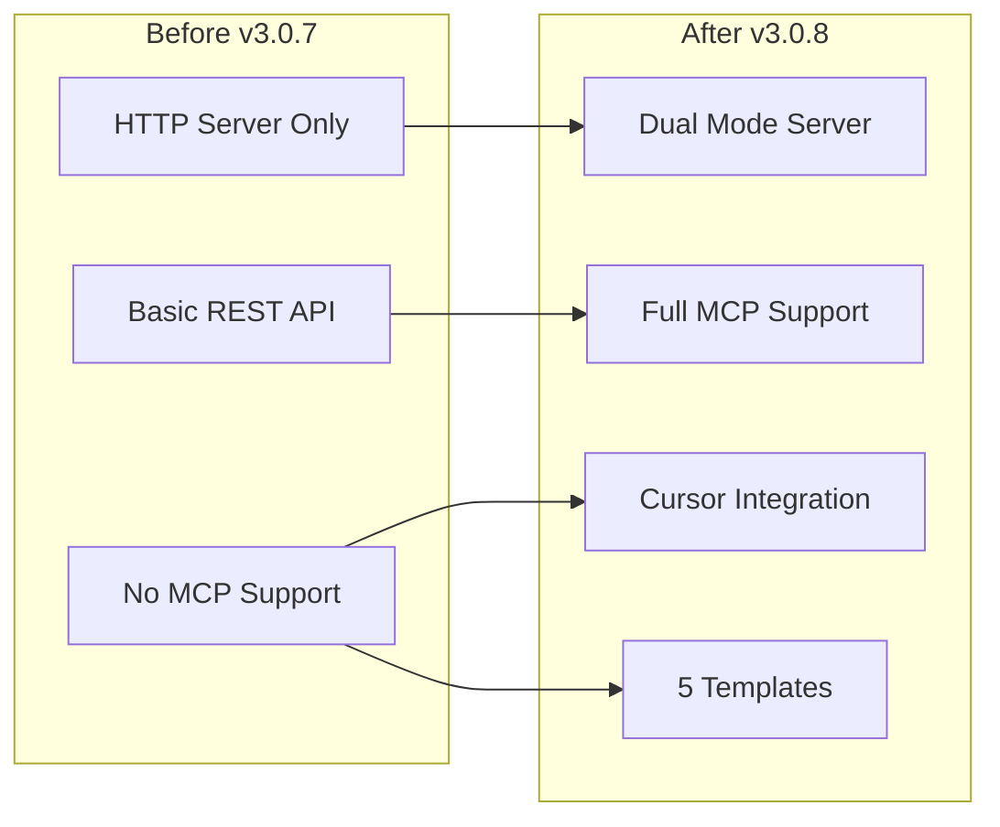
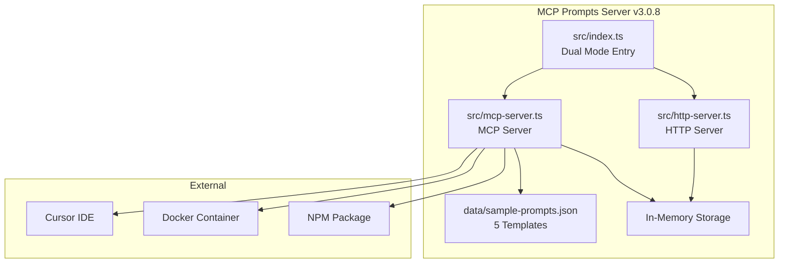
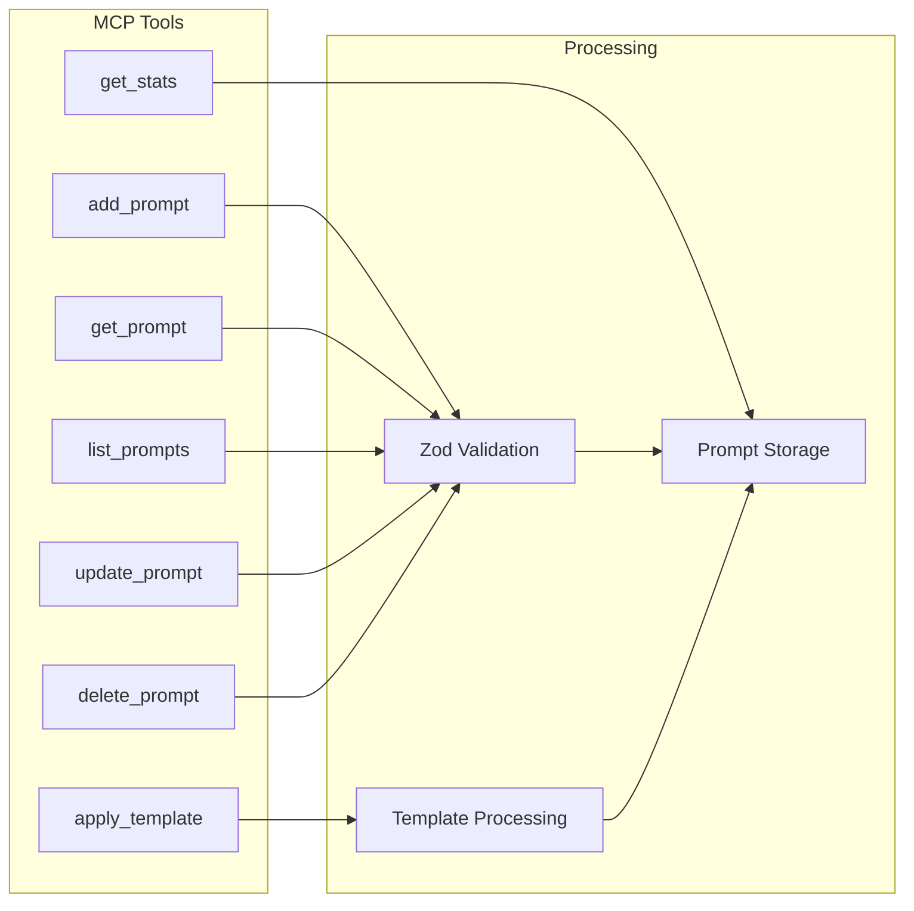
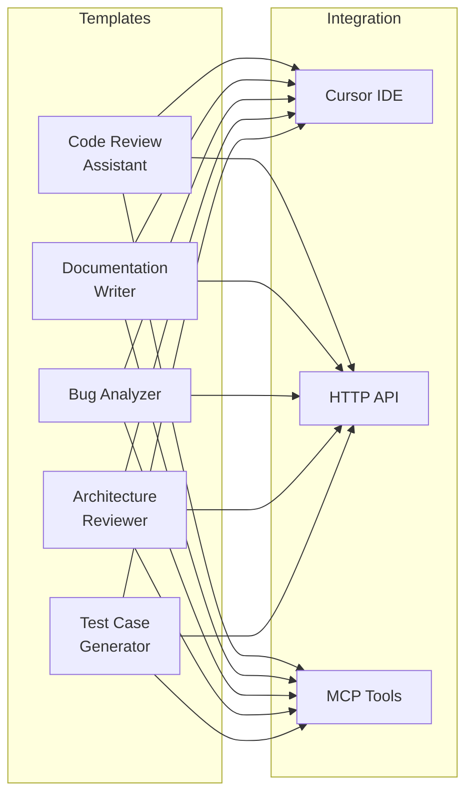
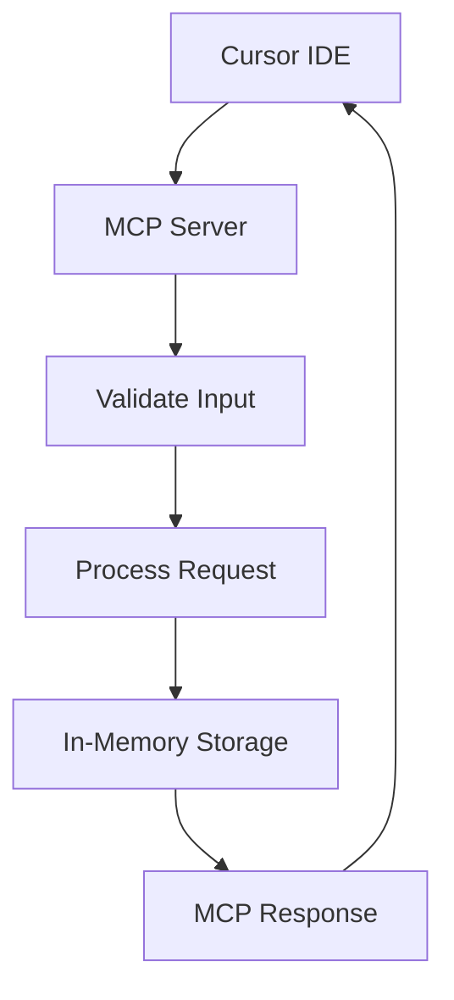
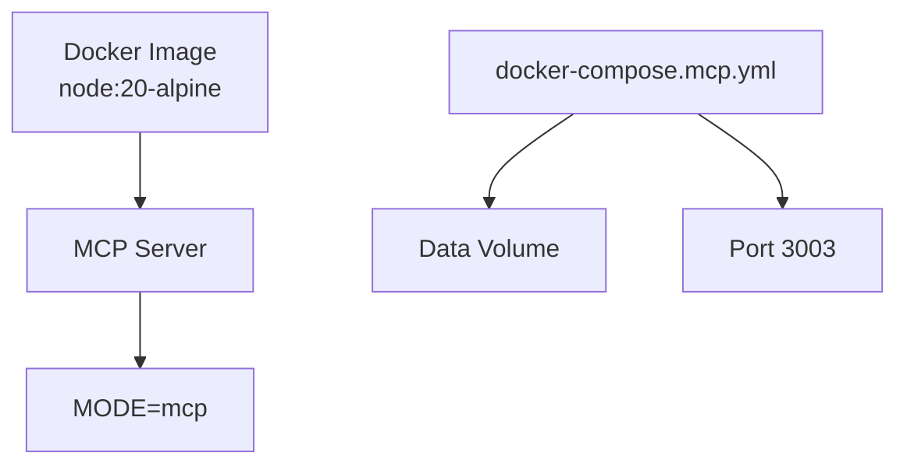
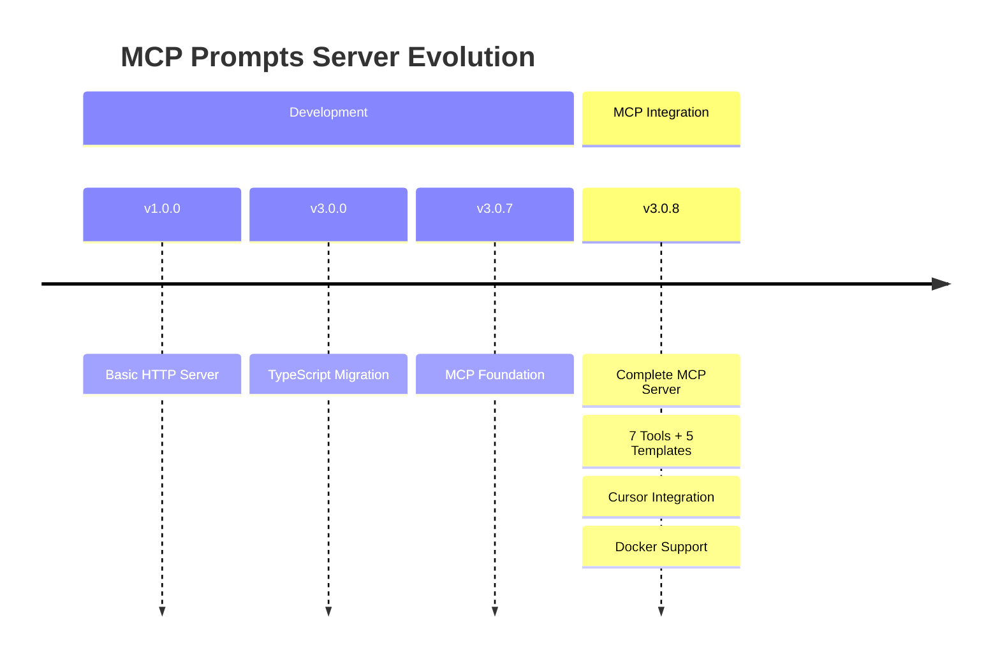

# MCP Prompts Server v3.0.8 - Changes Summary

## 🎉 Major Release: Complete MCP Integration

### Before vs After



## 🔧 Key Changes

### New Architecture



### 7 MCP Tools



### 5 Pre-loaded Templates



## 📊 Data Flow



## 🐳 Docker Support



## 📈 Version Evolution



## 📦 Package Information

- **Name:** `@sparesparrow/mcp-prompts@3.0.8`
- **Size:** 49.8 kB (66 files)
- **Registry:** https://registry.npmjs.org/
- **Status:** ✅ Production Ready

## 🎯 Key Achievements

1. **Complete MCP Integration** - Full protocol support
2. **7 MCP Tools** - Complete prompt management
3. **5 Pre-loaded Templates** - Ready-to-use prompts
4. **Cursor Integration** - Seamless IDE experience
5. **Docker Support** - Production deployment
6. **Comprehensive Documentation** - Visual diagrams included

## 🔄 Template Processing

```mermaid
flowchart LR
    TEMPLATE[Template with {{variables}}] --> PARSE[Parse Template]
    VARIABLES[JSON Variables] --> SUBSTITUTE[Substitute Variables]
    PARSE --> SUBSTITUTE
    SUBSTITUTE --> RESULT[Final Template]
```

---

## 📋 Summary

The MCP Prompts Server v3.0.8 transforms from a basic HTTP server to a complete MCP server with:

- **Dual Mode Operation** (HTTP + MCP)
- **7 MCP Tools** for prompt management
- **5 Pre-loaded Templates** for immediate use
- **Cursor Integration** for seamless IDE experience
- **Docker Support** for production deployment

The visual diagrams demonstrate the "show over tell" approach, making complex relationships immediately clear.
