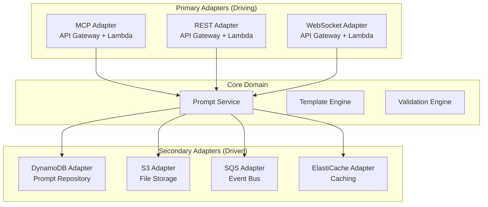
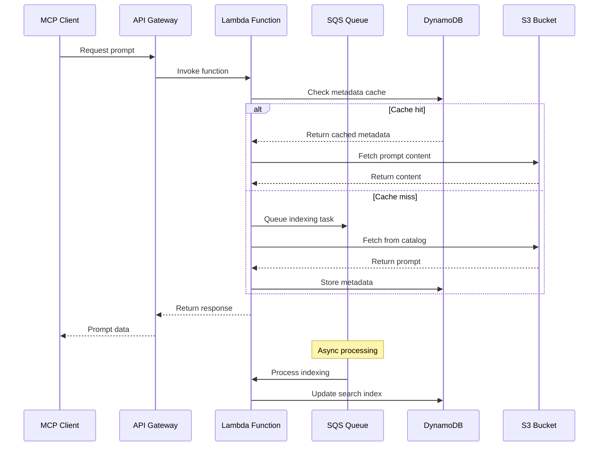
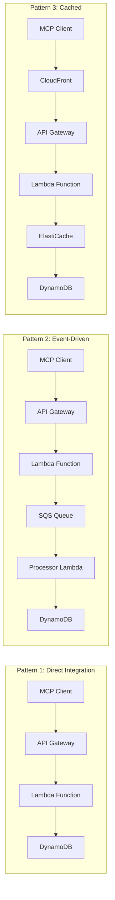

# MCP-Prompts AWS Deployment Setup Guide

*A comprehensive guide for deploying the MCP-Prompts ecosystem on AWS using S3, SQS, and DynamoDB*

## Table of Contents
- [Project Overview](#project-overview)
- [Architecture Overview](#architecture-overview)
- [AWS Services Integration](#aws-services-integration)
- [Deployment Strategy](#deployment-strategy)
- [Implementation Guide](#implementation-guide)
- [Monitoring and Operations](#monitoring-and-operations)
- [Whiteboard Session Prep](#whiteboard-session-prep)
- [Interview Guide](#interview-guide)

## Project Overview

The **MCP-Prompts** ecosystem consists of three interconnected repositories designed for managing AI prompts using the Model Context Protocol (MCP):

### Core Repositories
1. **[mcp-prompts](https://github.com/sparesparrow/mcp-prompts)** - Main TypeScript MCP server implementing hexagonal architecture
2. **[mcp-prompts-catalog](https://github.com/sparesparrow/mcp-prompts-catalog)** - Curated prompt collection with JSON/YAML/TXT/MD support
3. **[mcp-prompts-contracts](https://github.com/sparesparrow/mcp-prompts-contracts)** - Shared API contracts and OpenAPI specifications

### Technology Stack
- **Language**: TypeScript/Node.js
- **Architecture**: Hexagonal (Ports & Adapters)
- **Protocol**: Model Context Protocol (MCP)
- **Package Manager**: PNPM (monorepo structure)
- **Build System**: SWC + TypeScript

## Architecture Overview


### Hexagonal Architecture Mapping

The deployment maps the hexagonal architecture components to AWS services:



## AWS Services Integration

### Why These Services?

#### Amazon S3 (Simple Storage Service)
- **Purpose**: Static asset hosting and large prompt template storage
- **Use Cases**:
  - Host mcp-prompts-catalog JSON/YAML/MD files
  - Store large prompt templates and media assets
  - Serve static web assets for MCP Inspector UI
  - Backup and archival of prompt versions
- **Benefits**:
  - Cost-effective storage (Free Tier: 5GB)
  - Global CDN integration with CloudFront
  - Versioning and lifecycle policies
  - Event-driven triggers for processing

#### Amazon SQS (Simple Queue Service) 
- **Purpose**: Asynchronous processing and event-driven architecture
- **Use Cases**:
  - Decouple prompt processing from API responses
  - Handle batch operations (bulk import/export)
  - Process webhook events from GitHub (catalog updates)
  - Manage background tasks (indexing, validation)
- **Benefits**:
  - Reliable message delivery
  - Automatic scaling
  - Dead letter queue support
  - Free Tier: 1M requests/month

#### Amazon DynamoDB
- **Purpose**: High-performance NoSQL database for prompt metadata and caching
- **Use Cases**:
  - Store prompt metadata and search indices
  - Session management and user preferences
  - Real-time analytics and usage metrics
  - Caching frequently accessed prompts
- **Benefits**:
  - Single-digit millisecond latency
  - Automatic scaling
  - Global tables for multi-region
  - Free Tier: 25GB storage + 25 RCU/WCU

### Data Flow Architecture



## Deployment Strategy

### Infrastructure as Code (AWS CDK)

```typescript
// cdk/lib/mcp-prompts-stack.ts
import * as cdk from 'aws-cdk-lib';
import * as lambda from 'aws-cdk-lib/aws-lambda';
import * as apigateway from 'aws-cdk-lib/aws-apigateway';
import * as dynamodb from 'aws-cdk-lib/aws-dynamodb';
import * as s3 from 'aws-cdk-lib/aws-s3';
import * as sqs from 'aws-cdk-lib/aws-sqs';

export class McpPromptsStack extends cdk.Stack {
  constructor(scope: Construct, id: string, props?: cdk.StackProps) {
    super(scope, id, props);

    // S3 Bucket for catalog and assets
    const promptsBucket = new s3.Bucket(this, 'PromptsBucket', {
      bucketName: 'mcp-prompts-catalog-bucket',
      versioned: true,
      cors: [{
        allowedOrigins: ['*'],
        allowedMethods: [s3.HttpMethods.GET, s3.HttpMethods.PUT],
        allowedHeaders: ['*']
      }]
    });

    // DynamoDB Tables
    const promptsTable = new dynamodb.Table(this, 'PromptsTable', {
      tableName: 'mcp-prompts',
      partitionKey: { name: 'id', type: dynamodb.AttributeType.STRING },
      sortKey: { name: 'version', type: dynamodb.AttributeType.STRING },
      billingMode: dynamodb.BillingMode.PAY_PER_REQUEST,
      globalSecondaryIndexes: [{
        indexName: 'category-index',
        partitionKey: { name: 'category', type: dynamodb.AttributeType.STRING }
      }]
    });

    // SQS Queues
    const processingQueue = new sqs.Queue(this, 'ProcessingQueue', {
      queueName: 'mcp-prompts-processing',
      deadLetterQueue: {
        queue: new sqs.Queue(this, 'ProcessingDLQ'),
        maxReceiveCount: 3
      }
    });

    // Lambda Functions
    const mcpServerLambda = new lambda.Function(this, 'McpServerFunction', {
      runtime: lambda.Runtime.NODEJS_18_X,
      code: lambda.Code.fromAsset('dist'),
      handler: 'index.handler',
      environment: {
        PROMPTS_TABLE: promptsTable.tableName,
        PROMPTS_BUCKET: promptsBucket.bucketName,
        PROCESSING_QUEUE: processingQueue.queueUrl
      },
      timeout: cdk.Duration.seconds(30)
    });

    // API Gateway
    const api = new apigateway.RestApi(this, 'McpPromptsApi', {
      restApiName: 'MCP Prompts Service',
      defaultCorsPreflightOptions: {
        allowOrigins: apigateway.Cors.ALL_ORIGINS,
        allowMethods: apigateway.Cors.ALL_METHODS
      }
    });

    api.root.addProxy({
      defaultIntegration: new apigateway.LambdaIntegration(mcpServerLambda)
    });

    // Grant permissions
    promptsTable.grantReadWriteData(mcpServerLambda);
    promptsBucket.grantReadWrite(mcpServerLambda);
    processingQueue.grantSendMessages(mcpServerLambda);
  }
}
```

### Deployment Commands

```bash
# Install AWS CDK
npm install -g aws-cdk

# Initialize CDK project
cdk init app --language typescript
cd cdk

# Install dependencies
npm install

# Bootstrap CDK (one-time setup)
cdk bootstrap

# Deploy infrastructure
cdk deploy --all

# Update specific stack
cdk deploy McpPromptsStack

# Clean up
cdk destroy --all
```

## Implementation Guide

### 1. Environment Setup

```bash
# Clone repositories
git clone https://github.com/sparesparrow/mcp-prompts.git
git clone https://github.com/sparesparrow/mcp-prompts-catalog.git
git clone https://github.com/sparesparrow/mcp-prompts-contracts.git

# Install dependencies
cd mcp-prompts
pnpm install
pnpm run build

# Configure AWS CLI
aws configure
# Enter your AWS Access Key, Secret Key, Region (eu-central-1), and output format (json)
```

### 2. AWS Adapter Implementation

```typescript
// adapters/aws-dynamodb-adapter.ts
import { DynamoDBClient, PutItemCommand, GetItemCommand, QueryCommand } from '@aws-sdk/client-dynamodb';
import { IPromptRepository } from '../core/ports/prompt-repository.interface';
import { Prompt } from '../core/entities/prompt.entity';

export class DynamoDBAdapter implements IPromptRepository {
  private client: DynamoDBClient;
  
  constructor(private tableName: string) {
    this.client = new DynamoDBClient({ region: process.env.AWS_REGION });
  }

  async save(prompt: Prompt): Promise<void> {
    const command = new PutItemCommand({
      TableName: this.tableName,
      Item: {
        id: { S: prompt.id },
        version: { S: prompt.version },
        name: { S: prompt.name },
        template: { S: prompt.template },
        category: { S: prompt.category },
        createdAt: { S: prompt.createdAt.toISOString() }
      }
    });
    
    await this.client.send(command);
  }

  async findById(id: string): Promise<Prompt | null> {
    const command = new GetItemCommand({
      TableName: this.tableName,
      Key: {
        id: { S: id },
        version: { S: 'latest' }
      }
    });
    
    const result = await this.client.send(command);
    
    if (!result.Item) return null;
    
    return new Prompt(
      result.Item.id.S!,
      result.Item.name.S!,
      result.Item.template.S!,
      result.Item.category.S!,
      result.Item.version.S!
    );
  }

  async findByCategory(category: string): Promise<Prompt[]> {
    const command = new QueryCommand({
      TableName: this.tableName,
      IndexName: 'category-index',
      KeyConditionExpression: 'category = :category',
      ExpressionAttributeValues: {
        ':category': { S: category }
      }
    });
    
    const result = await this.client.send(command);
    
    return result.Items?.map(item => new Prompt(
      item.id.S!,
      item.name.S!,
      item.template.S!,
      item.category.S!,
      item.version.S!
    )) || [];
  }
}
```

### 3. S3 Integration for Catalog

```typescript
// adapters/s3-catalog-adapter.ts
import { S3Client, GetObjectCommand, PutObjectCommand } from '@aws-sdk/client-s3';
import { ICatalogRepository } from '../core/ports/catalog-repository.interface';

export class S3CatalogAdapter implements ICatalogRepository {
  private client: S3Client;
  
  constructor(private bucketName: string) {
    this.client = new S3Client({ region: process.env.AWS_REGION });
  }

  async syncFromGitHub(): Promise<void> {
    // Download latest catalog from GitHub
    const response = await fetch('https://raw.githubusercontent.com/sparesparrow/mcp-prompts-catalog/main/prompts/index.json');
    const catalog = await response.json();
    
    // Upload to S3
    const command = new PutObjectCommand({
      Bucket: this.bucketName,
      Key: 'catalog/index.json',
      Body: JSON.stringify(catalog),
      ContentType: 'application/json'
    });
    
    await this.client.send(command);
  }

  async getPromptTemplate(category: string, name: string): Promise<string> {
    const command = new GetObjectCommand({
      Bucket: this.bucketName,
      Key: `prompts/${category}/${name}.json`
    });
    
    const response = await this.client.send(command);
    const content = await response.Body?.transformToString();
    
    return JSON.parse(content!).template;
  }
}
```

### 4. SQS Event Processing

```typescript
// handlers/sqs-processor.ts
import { SQSClient, SendMessageCommand, ReceiveMessageCommand, DeleteMessageCommand } from '@aws-sdk/client-sqs';
import { PromptIndexingService } from '../core/services/prompt-indexing.service';

export class SQSProcessor {
  private client: SQSClient;
  private indexingService: PromptIndexingService;
  
  constructor(
    private queueUrl: string,
    indexingService: PromptIndexingService
  ) {
    this.client = new SQSClient({ region: process.env.AWS_REGION });
    this.indexingService = indexingService;
  }

  async enqueueIndexing(promptId: string, operation: 'create' | 'update' | 'delete'): Promise<void> {
    const command = new SendMessageCommand({
      QueueUrl: this.queueUrl,
      MessageBody: JSON.stringify({
        promptId,
        operation,
        timestamp: new Date().toISOString()
      })
    });
    
    await this.client.send(command);
  }

  async processMessages(): Promise<void> {
    const command = new ReceiveMessageCommand({
      QueueUrl: this.queueUrl,
      MaxNumberOfMessages: 10,
      WaitTimeSeconds: 20
    });
    
    const result = await this.client.send(command);
    
    for (const message of result.Messages || []) {
      try {
        const body = JSON.parse(message.Body!);
        
        switch (body.operation) {
          case 'create':
          case 'update':
            await this.indexingService.indexPrompt(body.promptId);
            break;
          case 'delete':
            await this.indexingService.removeFromIndex(body.promptId);
            break;
        }
        
        // Delete processed message
        await this.client.send(new DeleteMessageCommand({
          QueueUrl: this.queueUrl,
          ReceiptHandle: message.ReceiptHandle!
        }));
        
      } catch (error) {
        console.error('Error processing message:', error);
      }
    }
  }
}
```

## Monitoring and Operations

### CloudWatch Integration

```typescript
// monitoring/cloudwatch-metrics.ts
import { CloudWatchClient, PutMetricDataCommand } from '@aws-sdk/client-cloudwatch';

export class MetricsCollector {
  private client: CloudWatchClient;
  
  constructor() {
    this.client = new CloudWatchClient({ region: process.env.AWS_REGION });
  }

  async recordPromptAccess(promptId: string, category: string): Promise<void> {
    const command = new PutMetricDataCommand({
      Namespace: 'MCP/Prompts',
      MetricData: [{
        MetricName: 'PromptAccessCount',
        Value: 1,
        Unit: 'Count',
        Dimensions: [
          { Name: 'PromptId', Value: promptId },
          { Name: 'Category', Value: category }
        ],
        Timestamp: new Date()
      }]
    });
    
    await this.client.send(command);
  }

  async recordLatency(operation: string, latencyMs: number): Promise<void> {
    const command = new PutMetricDataCommand({
      Namespace: 'MCP/Prompts',
      MetricData: [{
        MetricName: 'OperationLatency',
        Value: latencyMs,
        Unit: 'Milliseconds',
        Dimensions: [{ Name: 'Operation', Value: operation }],
        Timestamp: new Date()
      }]
    });
    
    await this.client.send(command);
  }
}
```

### Health Checks

```typescript
// health/health-check.ts
export class HealthCheck {
  constructor(
    private dynamoAdapter: DynamoDBAdapter,
    private s3Adapter: S3CatalogAdapter,
    private sqsProcessor: SQSProcessor
  ) {}

  async checkHealth(): Promise<{
    status: 'healthy' | 'unhealthy';
    services: Record<string, boolean>;
  }> {
    const services = {
      dynamodb: false,
      s3: false,
      sqs: false
    };

    try {
      // Test DynamoDB connection
      await this.dynamoAdapter.findById('health-check');
      services.dynamodb = true;
    } catch (error) {
      console.error('DynamoDB health check failed:', error);
    }

    try {
      // Test S3 connection
      await this.s3Adapter.getPromptTemplate('health', 'check');
      services.s3 = true;
    } catch (error) {
      console.error('S3 health check failed:', error);
    }

    try {
      // Test SQS connection
      await this.sqsProcessor.enqueueIndexing('health-check', 'create');
      services.sqs = true;
    } catch (error) {
      console.error('SQS health check failed:', error);
    }

    const allHealthy = Object.values(services).every(Boolean);

    return {
      status: allHealthy ? 'healthy' : 'unhealthy',
      services
    };
  }
}
```

## Whiteboard Session Prep

### Session Structure (45-60 minutes)

#### Phase 1: Requirements Gathering (10 minutes)
1. **Functional Requirements**
   - MCP server hosting AI prompts
   - CRUD operations for prompts
   - Template processing with variables
   - Catalog synchronization from GitHub
   - Support for multiple formats (JSON, YAML, MD, TXT)

2. **Non-Functional Requirements**
   - Handle 1000+ concurrent MCP clients
   - Sub-100ms response times for cached prompts
   - 99.9% availability
   - Cost optimization for startup usage
   - Global deployment capability

3. **Constraints**
   - Must use AWS Free Tier initially
   - TypeScript/Node.js stack
   - Serverless-first approach
   - Integration with existing MCP ecosystem

#### Phase 2: High-Level Design (15 minutes)

**Key Components to Discuss:**
- API Gateway for MCP protocol handling
- Lambda functions for business logic
- DynamoDB for metadata and caching
- S3 for static assets and large templates
- SQS for asynchronous processing
- CloudFront for global CDN

**Architecture Decisions:**
1. **Serverless vs Container**: Choose serverless for cost and scalability
2. **Database Choice**: DynamoDB vs RDS (NoSQL wins for flexibility)
3. **Caching Strategy**: Multi-level (DynamoDB + Lambda memory + CDN)
4. **Event-Driven**: SQS for decoupling operations

#### Phase 3: Detailed Design (20 minutes)

**Data Model Design:**
```
Prompts Table (DynamoDB):
- PK: prompt_id (String)
- SK: version (String) 
- GSI1PK: category (String)
- GSI1SK: created_at (String)
- name, template, metadata, tags
```

**API Design:**
```
GET /prompts/{id} - Get prompt by ID
POST /prompts - Create new prompt
PUT /prompts/{id} - Update prompt
DELETE /prompts/{id} - Delete prompt
GET /prompts?category=X - List by category
POST /prompts/{id}/apply - Apply template variables
```

**Scaling Considerations:**
- Lambda concurrency limits (1000 default)
- DynamoDB read/write capacity
- S3 request rate limits
- API Gateway throttling

#### Phase 4: Advanced Topics (10-15 minutes)

**Security:**
- API Gateway authentication (Cognito)
- IAM roles and policies
- VPC endpoints for private access
- Encryption at rest and in transit

**Monitoring:**
- CloudWatch metrics and alarms
- X-Ray tracing for debugging
- Custom metrics for business KPIs
- Health check endpoints

**Disaster Recovery:**
- Multi-region DynamoDB Global Tables
- S3 cross-region replication
- Lambda deployment in multiple regions
- Route 53 health checks

### Common Whiteboard Patterns



## Interview Guide

### Technical Deep-Dive Questions

#### 1. Architecture & Design
**Q: "Why did you choose this specific AWS service combination?"**

**Answer Framework:**
- **S3**: Cost-effective storage, event triggers, global distribution
- **DynamoDB**: Single-digit ms latency, automatic scaling, NoSQL flexibility
- **SQS**: Reliable async processing, decoupling, built-in retry logic
- **Lambda**: Pay-per-use, auto-scaling, perfect for MCP request-response pattern

**Q: "How would you handle a sudden 10x increase in traffic?"**

**Answer Framework:**
1. **Immediate**: Lambda auto-scales, DynamoDB on-demand billing
2. **Optimization**: Add ElastiCache, optimize DynamoDB queries
3. **Long-term**: Multi-region deployment, CDN optimization
4. **Cost management**: Reserved capacity, S3 intelligent tiering

#### 2. Data Management
**Q: "How do you ensure data consistency across services?"**

**Answer Framework:**
- **Eventual consistency** model acceptable for prompt catalog
- **Strong consistency** for user sessions and metadata
- **Event sourcing** pattern for audit trails
- **Compensation transactions** for distributed operations

**Q: "How would you implement versioning for prompts?"**

**Answer Framework:**
```
Data Structure:
PK: prompt_id
SK: version_timestamp
Attributes: content, metadata, is_latest

Query Patterns:
- Latest version: GSI with is_latest flag
- Version history: Query by PK
- Point-in-time recovery: Range query on SK
```

#### 3. Performance & Scalability
**Q: "What are the potential bottlenecks and how do you address them?"**

**Answer Framework:**
1. **DynamoDB hot partitions**: Use composite keys, distribute access
2. **Lambda cold starts**: Provisioned concurrency, connection pooling
3. **API Gateway limits**: Caching, request batching
4. **S3 request rates**: Prefix distribution, CloudFront caching

#### 4. Security & Compliance
**Q: "How do you secure sensitive prompt data?"**

**Answer Framework:**
- **Encryption**: KMS for DynamoDB, S3 server-side encryption
- **Access control**: IAM policies, resource-based policies
- **Network security**: VPC endpoints, private subnets
- **Audit logging**: CloudTrail, application logs

### Behavioral Questions (Amazon Leadership Principles)

#### Customer Obsession
**Q: "How does this architecture benefit MCP users?"**

**Answer Framework:**
- **Low latency**: Sub-100ms response times
- **High availability**: 99.9% uptime with multi-AZ deployment
- **Cost efficiency**: Free tier usage, pay-per-request model
- **Global access**: CloudFront CDN for worldwide performance

#### Ownership
**Q: "How would you monitor and maintain this system in production?"**

**Answer Framework:**
- **Proactive monitoring**: CloudWatch alarms, custom metrics
- **Automated recovery**: Auto-scaling, health checks
- **Operational excellence**: Infrastructure as Code, CI/CD pipelines
- **Continuous improvement**: Performance analysis, cost optimization

#### Bias for Action
**Q: "How would you rapidly prototype this solution?"**

**Answer Framework:**
1. **Week 1**: Basic Lambda + DynamoDB setup
2. **Week 2**: API Gateway integration, basic CRUD
3. **Week 3**: S3 integration, catalog sync
4. **Week 4**: SQS processing, monitoring
5. **MVP deployment**: Minimal viable product in production

### Cost Analysis Framework

**Monthly Cost Estimation (assuming moderate usage):**

```
Service               | Usage              | Cost
---------------------|--------------------|---------
Lambda               | 1M requests        | $2.00
DynamoDB            | 25GB + 1M RW       | $3.25  
S3                  | 10GB storage       | $0.25
API Gateway         | 1M requests        | $3.50
SQS                 | 1M messages        | $0.40
CloudWatch          | Basic monitoring   | $2.00
---------------------|--------------------|---------
Total Monthly        |                    | $11.40
```

**Optimization Strategies:**
- Use AWS Free Tier maximally (first 12 months)
- Implement intelligent caching to reduce database calls
- Compress S3 objects and use lifecycle policies
- Optimize Lambda memory allocation for cost/performance

### Demo Script Preparation

**5-Minute Technical Demo:**

1. **Show Architecture Diagram** (30 seconds)
   - Point out main components and data flow
   - Highlight AWS service integration

2. **Code Walkthrough** (2 minutes)
   - Hexagonal architecture implementation
   - AWS SDK integration patterns
   - Error handling and retry logic

3. **Deployment Process** (1.5 minutes)
   - CDK stack definition
   - CI/CD pipeline overview
   - Environment configuration

4. **Monitoring Dashboard** (1 minute)
   - CloudWatch metrics
   - Health check status
   - Cost tracking

5. **Q&A Buffer** (remaining time)
   - Address specific technical questions
   - Discuss trade-offs and alternatives

---

## Summary

This AWS deployment setup provides a **production-ready, cost-effective, and scalable** solution for the MCP-Prompts ecosystem. The architecture leverages AWS's serverless services to achieve:

- **Cost Efficiency**: Stay within Free Tier limits initially
- **Performance**: Sub-100ms response times with proper caching
- **Reliability**: Multi-AZ deployment with automatic failover
- **Scalability**: Auto-scaling Lambda and DynamoDB
- **Maintainability**: Infrastructure as Code with AWS CDK

The whiteboard session and interview preparation materials ensure you can confidently present and defend this architecture in technical discussions, demonstrating both deep AWS knowledge and practical system design skills.

**Key Takeaways:**
1. **Serverless-first** approach for cost optimization
2. **Event-driven** architecture for better decoupling
3. **Multi-tier caching** for performance optimization
4. **Infrastructure as Code** for reproducible deployments
5. **Comprehensive monitoring** for operational excellence