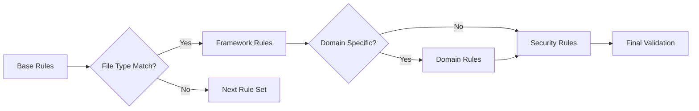
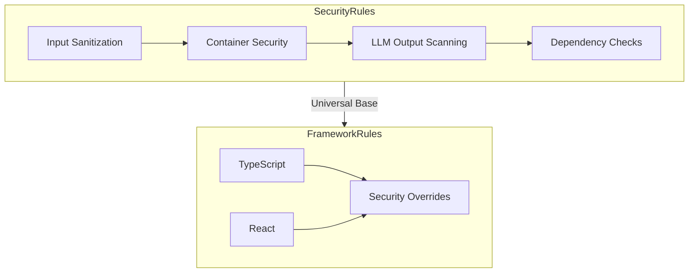
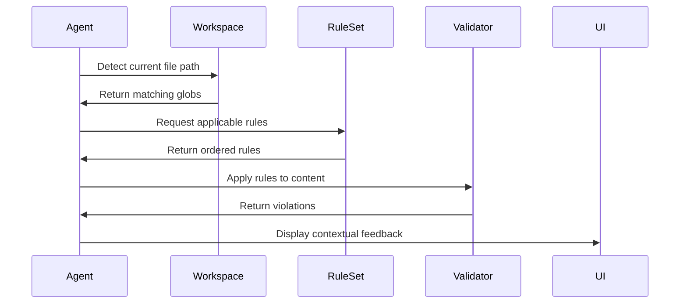
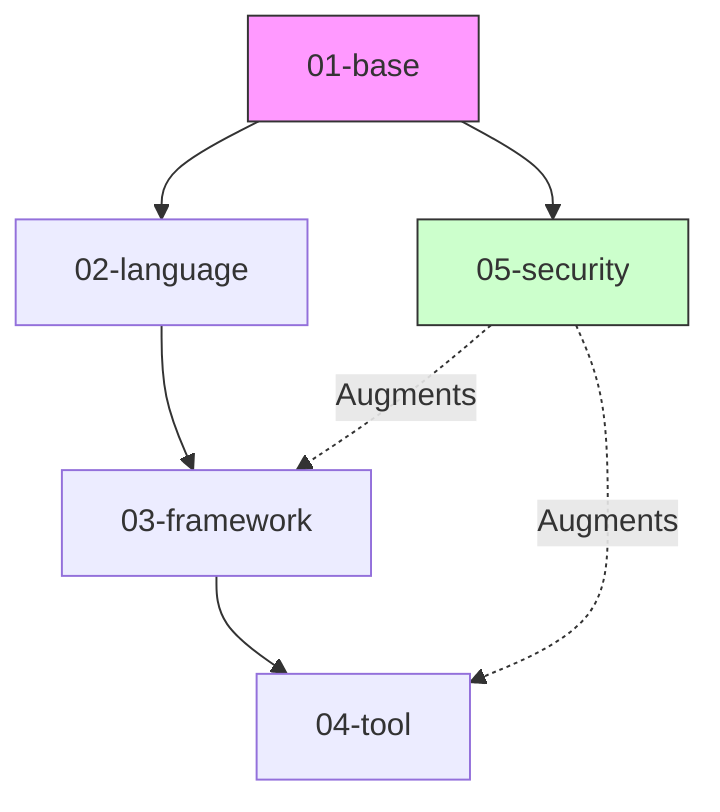
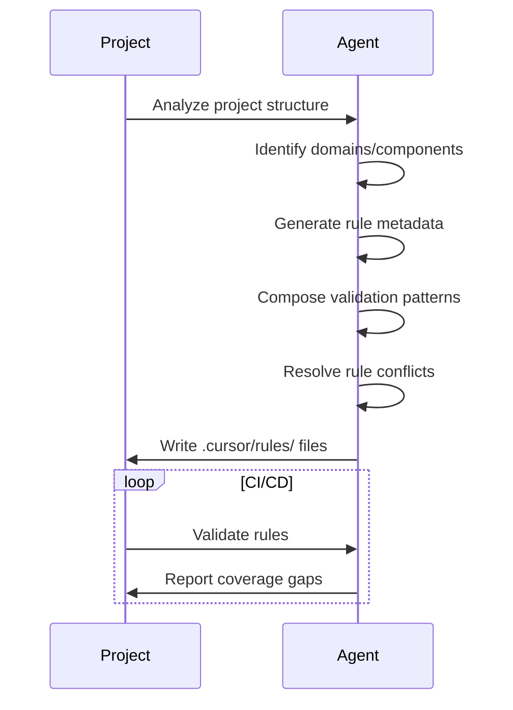

 there should be multiple files in project ruleset since the idea is to modularize the rules and allow agent composer to choose appropriate rule based on the `description` content if   `globs` matches the file path. for example:

```
---
description: Guidelines and best practices for developing MCP servers with TypeScript
globs: ["extensions/*/src/**/*.ts"]
---
```

also, you should first plan out the structure of the rules and purpose of each of them, which could be achieved by first defining the list of rule metadata (file name, description, globs) and then start implementing them one by one, storing artifact for each
rules are supposed to be placed in `.cursor/rules/` folder.

Example approach:

1. **Rule Architecture Design**
```markdown
1.1. Create a rule matrix:
- Base Rules (01-*.md): Universal patterns (`**/*` globs)
- Framework Rules (02-*.md): Language/tech-specific standards
- Domain Rules (03-*.md): Feature/business logic constraints
- Security Rules (04-*.md): Cross-cutting security requirements

1.2. Priority ordering:
- Numeric filenames (01-base.md → 04-security.md)
- More specific globs override broader patterns
```

2. **Metadata Requirements**
```yaml
# Required frontmatter for all rule files
---
description: "Clear scope definition"
globs: ["list/of/matching/patterns"]
priority: 1-100 (optional) # Higher = later application
dependencies: [list.of.required.rules] (optional)
---
```

3. **Content Structure Guidelines**
```markdown
3.1. Mandatory sections:
- Overview: 2-3 sentence purpose statement
- Standards: Bulleted list of core principles
- Examples: Code blocks with Good/Bad comparisons
- Validation: Machine-enforceable patterns (JSON/TS schemas)

3.2. Optional sections:
- Migration Paths: For deprecated patterns
- Tooling Config: ESLint/Prettier/TSConfig snippets
- Exception Process: How to request rule exemptions
```

4. **Glob Pattern Strategy**
```bash
# Use micromatch syntax for precision:
1. Framework targeting: "extensions/*/src/**/*.ts"
2. Component isolation: "src/components/**/*.tsx" 
3. Config files: "**/*.config.{js,ts}"
4. Exclusion patterns: "!**/legacy/**/*"
```

5. **Validation Layer Implementation**
```typescript
// Every rule must include machine-readable validation
interface RuleValidation {
  schema: ZodSchema; // JSON schema
  astPatterns?: ESTreeMatcher[]; // Code structure checks
  globExceptions?: string[]; // Opt-out paths
  autoFix?: boolean; // Whether fixes can be automated
}

// Example TypeScript rule validation
const NoExplicitAnyRule: RuleValidation = {
  schema: z.object({
    code: z.string().refract(s => !s.includes(': any'))
  }),
  astPatterns: [{
    selector: 'TSTypeAnnotation Identifier[name="any"]',
    message: 'Explicit "any" type forbidden'
  }]
};
```

6. **Progressive Enhancement Protocol**


7. **Agent Generation Workflow**
```bash
1. Analyze project structure → Identify tech stack
2. Generate rule matrix → Prioritize by:
   - File type prevalence
   - Security criticality
   - Team preferences
3. For each rule category:
   a. Create markdown file with frontmatter
   b. Add human-readable guidelines
   c. Implement validation schema
   d. Test glob matching
4. Verify rule layering:
   - Base → Framework → Domain → Security
5. Generate IDE integration:
   - Add rule index to .cursor/manifest.json
   - Configure auto-application thresholds
```

8. **Exception Handling**
```markdown
8.1. Allow inline overrides:
```typescript
// cursor-ignore-next-line: rule-id
const temp: any = unsafeValue;
```

8.2. Support project-wide exemptions:
```json
// .cursor/exceptions.json
{
  "rule-42": {
    "files": ["legacy/**/*"],
    "expires": "2024-12-31"
  }
}
```

**Enforcement Checklist**
- [ ] All rules have machine-testable validations
- [ ] No glob pattern conflicts (test with `micromatch`)
- [ ] Security rules apply universally (globs: `**/*`)
- [ ] Framework rules override base rules appropriately
- [ ] Validation schemas cover 90%+ of standards

**Example Rule Generation**
```markdown
---
description: React hooks development standards
globs: ["src/**/*.tsx"]
dependencies: [base.rules.md]
---

# React Hooks Rules

## Hook Management
- Custom hooks must start with `use` prefix
- No conditional hook execution
- Cleanup effects with return functions

## Validation Schema
```typescript
const HookRules = {
  noConditionalHooks: {
    pattern: 'IfStatement > CallExpression[callee.name=/^use/]',
    message: 'Hooks cannot be called conditionally'
  }
};
```

**Bad Example**
```typescript
if (shouldFetch) {
  useEffect(() => { ... }); // ❌ Conditional hook
}
```

**Good Example**
```typescript
useEffect(() => {
  if (shouldFetch) { ... } // ✅ Conditional inside hook
}, [shouldFetch]);
```

This instruction set enables agents to generate context-aware, layered rulesets that combine human-readable standards with automated enforcement while maintaining project-specific adaptability.

Another approach:

1. **Modular Rule Architecture**
```markdown
- Create discrete rule files for distinct domains
- File naming: `NN-category.rules.md` (NN=priority number)
- Required components per file:
  ---
  description: <contextual purpose>
  globs: ["**/*.ts", "src/components/**/*"] # Ordered by specificity
  ---
  # Human-readable standards
  ```language
  # Machine-enforceable patterns
  ```
```

2. **Glob Pattern Strategy**
```python
def generate_globs(domain: str) -> list:
    """
    Returns ordered glob patterns based on domain specificity
    - Framework-specific: ["extensions/*/src/**/*.ts"]
    - General security: ["**/*"] 
    - CI/CD: [".github/**/*", "Dockerfile*"]
    """
    return {
        "base": ["**/*"],
        "typescript": ["**/*.ts", "**/*.tsx"],
        "react": ["src/components/**/*.tsx"],
        "security": ["**/*"],
        "cicd": [".github/**/*", "Dockerfile*"]
    }[domain]
```

3. **Rule Prioritization Logic**
```markdown
1. Process files in numeric order (01-*.rules.md first)
2. Apply most specific glob first within same priority tier
3. Security rules always apply after framework-specific rules
4. Base rules serve as foundation, specialized rules layer on top
```

4. **Content Generation Protocol**
```python
class RuleContent:
    def __init__(self, category):
        self.human_guidelines = {
            "structure": ["File organization standards"],
            "naming": ["File/component naming rules"]
        }
        
        self.machine_rules = {
            "validation": {"maxLength": 100},
            "security": {"regex": "[<>]"}
        }

    def generate_markdown(self):
        return f"""
## Human Guidelines
- {self.human_guidelines}

## Machine Rules
```json
{json.dumps(self.machine_rules)}
```
        """
```

5. **Security Integration Matrix**


6. **Validation Engine Requirements**
```typescript
interface ValidationRule {
    type: 'regex' | 'ast' | 'schema';
    pattern: string;
    errorMessage: string;
    severity: 'warning' | 'error';
}

function applyValidation(rules: ValidationRule[], code: string) {
    return rules.map(rule => {
        switch(rule.type) {
            case 'regex': 
                return testRegex(rule.pattern, code);
            case 'ast':
                return analyzeAST(code, rule.pattern);
            case 'schema':
                return validateJSONSchema(code, rule.pattern);
        }
    });
}
```

7. **Agent Implementation Checklist**
```markdown
- [ ] Generate numbered rule files with precise globs
- [ ] Include both human guidelines and machine rules
- [ ] Implement security scanning at multiple levels
- [ ] Add framework-specific overrides where needed
- [ ] Set up validation hooks for generated code
- [ ] Establish error recovery procedures
- [ ] Create audit logging integration
```

8. **Dynamic Rule Application Flow**


**Execution Strategy**
1. Start with base rules (`01-base.rules.md`) establishing universal standards
2. Layer framework-specific rules (TypeScript/React) with increasing priority
3. Apply security rules last to override unsafe patterns
4. Use glob specificity as tiebreaker for same-priority rules
5. Maintain audit trail of applied rules per file

This instruction set enables agents to generate context-aware, maintainable rule systems that balance generalization with specialization while enforcing critical security constraints.

Another approach:

**1. Rule Architecture Design**
```markdown
1.1. Domain Segmentation
- Identify 5 core domains:
  a) Base Standards (applies to all files)
  b) Language-Specific (TS/JS/Python)
  c) Framework-Specific (React/Vue)
  d) Tool-Specific (Composer Agent)
  e) Infrastructure (CI/CD/Security)

1.2. File Structure Protocol
.cursor/rules/
├─ 01-base.rules.md         # Broadest scope
├─ 02-language-*.rules.md   # Language-specific 
├─ 03-framework-*.rules.md  # Framework-specific
├─ 04-tool-*.rules.md       # Tool integrations
└─ 05-infra-*.rules.md      # Narrowest scope
```

**2. Metadata Requirements**
```yaml
# Required front matter
---
description: "Concisely state rule domain/purpose"
globs: [ordered list of minimatch patterns]
priority: 1-100 (optional) # Default: filename order
dependencies: (optional rules)
---

# Example
---
description: React component standards
globs: ["src/components/**/*.tsx"]
priority: 30  # Higher than base (10) but lower than security (90)
---
```

**3. Content Composition Logic**
```markdown
3.1. Required Sections
- Human-readable standards
- Code examples (Good/Bad patterns)
- Enforceable validation rules
- Reference to related rules

3.2. Validation Patterns
a) Code Snippets: Demonstrate compliant patterns
b) Regex Filters: Define forbidden patterns
c) Config Schemas: JSON schema examples
d) AST Rules: Abstract Syntax Tree requirements
```

**4. Specialization Hierarchy**


**5. Conflict Resolution Protocol**
```markdown
1. Explicit priority metadata wins
2. More specific glob pattern overrides
3. Later file in sort order overrides
4. Security rules (05-*) always supersede

# Evaluation Order
1. Collect all matching rules
2. Sort by priority (ascending)
3. Apply security rules last
4. Merge non-conflicting rules
```

**6. Security Integration Requirements**
```markdown
- All rules must include security section
- Universal security rules in 05-security.rules.md
- Context-specific hardening in other files
- Security glob patterns must include:
  - "**/Dockerfile*"
  - "**/*.config.json"
  - "**/composer/**/*"
```

**7. Automation Interface**
```typescript
interface CursorRule {
  description: string;
  globs: string[];
  validations: {
    codePatterns?: RegExp[];
    configSchemas?: JSONSchema[];
    astRules?: ASTCondition[];
    fileStructure?: DirectoryLayout[];
  };
  examples: {
    compliant: string[];
    nonCompliant: string[];
  };
}

// Agent Implementation
function applyRules(filePath: string): CursorRule[] {
  return matchingRules
    .sort((a,b) => (a.priority || 50) - (b.priority || 50))
    .filter(rule => minimatch(filePath, rule.globs));
}
```

**8. Validation Testing Standards**
```markdown
Each rule file must include:

1. Positive Test Cases
   - Compliant code examples
   - Approved configuration samples

2. Negative Test Cases
   - Non-compliant patterns
   - Security violation examples

3. Edge Case Coverage
   - Empty states
   - Boundary conditions
   - Error handling paths
```

**Implementation Checklist**
```markdown
- [ ] Verify glob pattern specificity
- [ ] Cross-reference dependent rules
- [ ] Include security hardening examples
- [ ] Add validation test cases
- [ ] Set priority for overlapping rules
- [ ] Document conflict resolutions
- [ ] Integrate with CI/CD pipelines
```

**Agent Generation Workflow**


This instruction set enables systematic creation of context-aware, conflict-free cursor rules that balance generalization with precise specialization while maintaining security-first principles.
