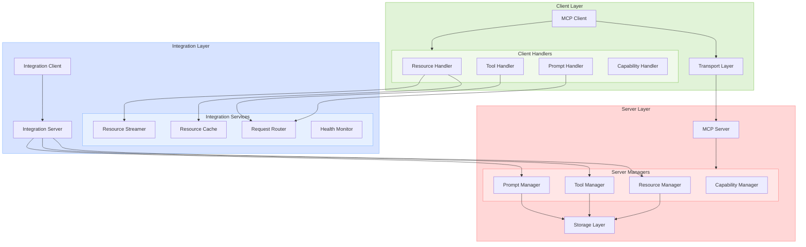
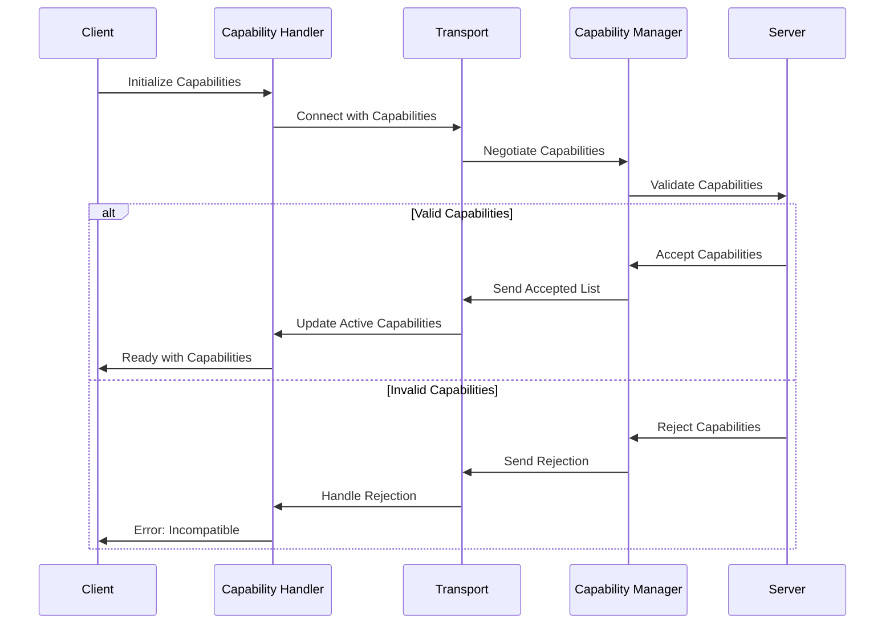
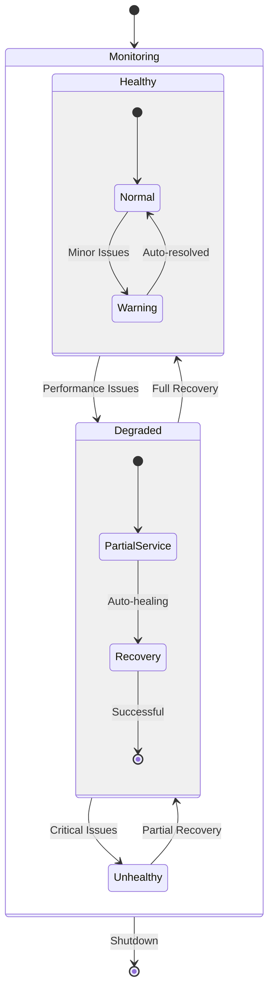
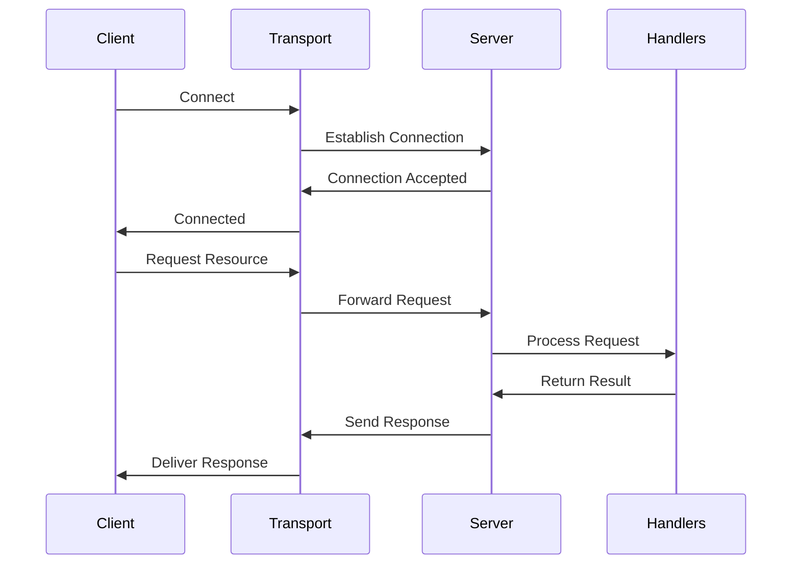
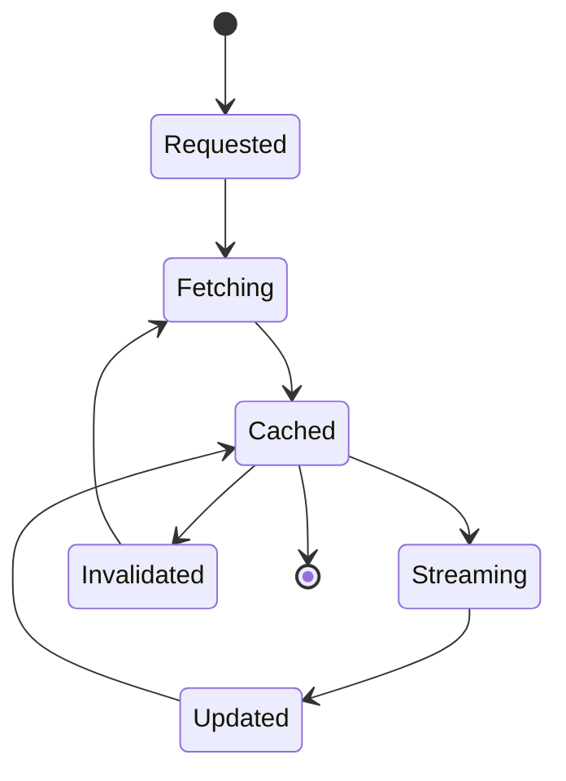

# MCP Architecture Overview

## Component Relationships



## Capability Management Flow



## Resource and Tool Flow

```mermaid
sequenceDiagram
    participant C as Client
    participant H as Handler
    participant T as Transport
    participant M as Manager
    participant S as Storage

    C->>+H: Request Operation
    H->>Cache: Check Cache
    
    alt Cache Hit
        Cache-->>H: Return Cached
        H-->>-C: Return Result
    else Cache Miss
        H->>+T: Forward Request
        T->>+M: Process Request
        M->>S: Access Storage
        S-->>M: Return Data
        M-->>-T: Send Response
        T-->>-H: Return Result
        H->>Cache: Update Cache
        H-->>-C: Return Result
    end
```

## Health Monitoring



## Transport Flow



## Resource Lifecycle

