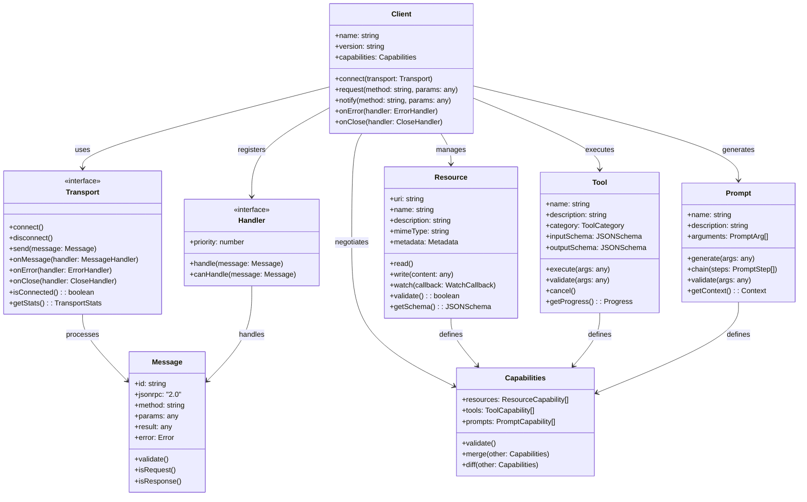
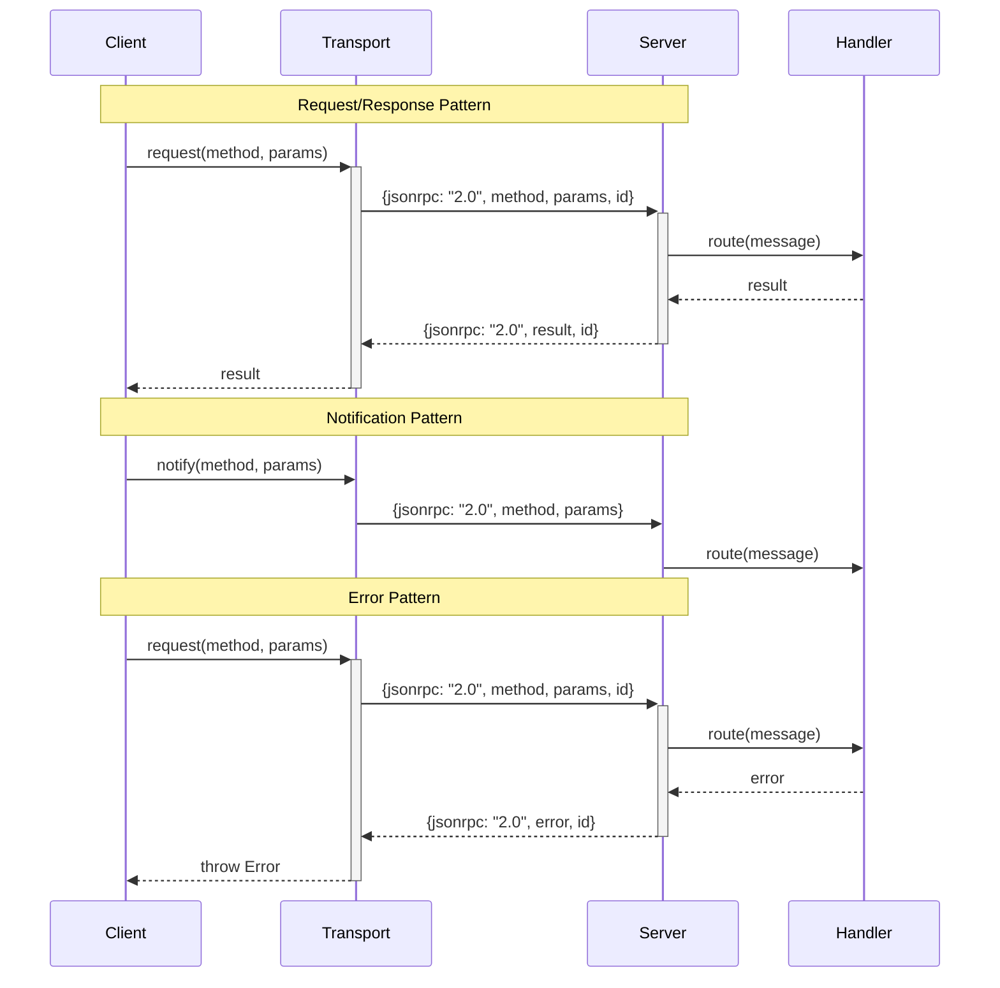
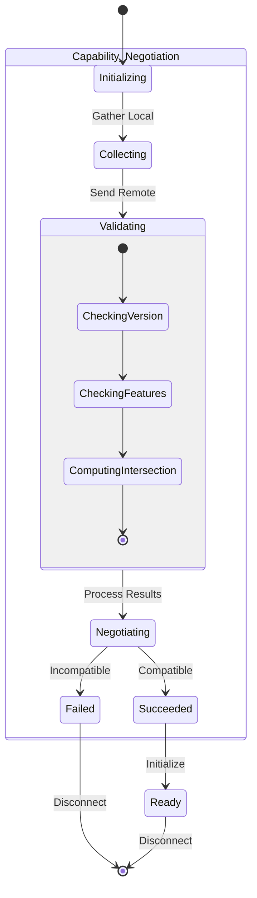
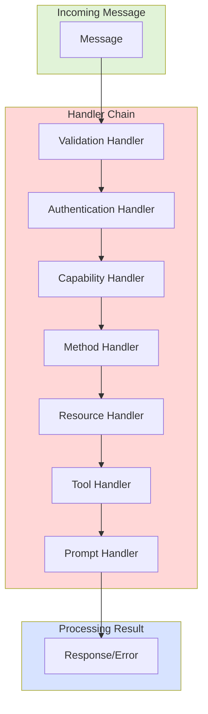

# MCP Core Concepts

## Interface Relationships

```mermaid
classDiagram
    class Client {
        +name: string
        +version: string
        +capabilities: Capabilities
        +connect(transport: Transport)
        +request(method: string, params: any)
        +notify(method: string, params: any)
        +onError(handler: ErrorHandler)
        +onClose(handler: CloseHandler)
    }

    class Transport {
        <<interface>>
        +connect()
        +disconnect()
        +send(message: Message)
        +onMessage(handler: MessageHandler)
        +onError(handler: ErrorHandler)
        +onClose(handler: CloseHandler)
        +isConnected(): boolean
        +getStats(): TransportStats
    }

    class Resource {
        +uri: string
        +name: string
        +description: string
        +mimeType: string
        +metadata: Metadata
        +read()
        +write(content: any)
        +watch(callback: WatchCallback)
        +validate(): boolean
        +getSchema(): JSONSchema
    }

    class Tool {
        +name: string
        +description: string
        +category: ToolCategory
        +inputSchema: JSONSchema
        +outputSchema: JSONSchema
        +execute(args: any)
        +validate(args: any)
        +cancel()
        +getProgress(): Progress
    }

    class Prompt {
        +name: string
        +description: string
        +arguments: PromptArg[]
        +generate(args: any)
        +chain(steps: PromptStep[])
        +validate(args: any)
        +getContext(): Context
    }

    class Capabilities {
        +resources: ResourceCapability[]
        +tools: ToolCapability[]
        +prompts: PromptCapability[]
        +validate()
        +merge(other: Capabilities)
        +diff(other: Capabilities)
    }

    class Message {
        +id: string
        +jsonrpc: "2.0"
        +method: string
        +params: any
        +result: any
        +error: Error
        +validate()
        +isRequest()
        +isResponse()
    }

    class Handler {
        <<interface>>
        +handle(message: Message)
        +canHandle(message: Message)
        +priority: number
    }

    Client --> Transport : uses
    Client --> Resource : manages
    Client --> Tool : executes
    Client --> Prompt : generates
    Client --> Capabilities : negotiates
    Client --> Handler : registers
    Transport --> Message : processes
    Handler --> Message : handles
    Resource --> Capabilities : defines
    Tool --> Capabilities : defines
    Prompt --> Capabilities : defines
```

## Message Flow Patterns

```mermaid
sequenceDiagram
    participant C as Client
    participant T as Transport
    participant S as Server
    participant H as Handler

    Note over C,S: Request/Response Pattern
    C->>+T: request(method, params)
    T->>+S: {jsonrpc: "2.0", method, params, id}
    S->>H: route(message)
    H-->>S: result
    S-->>-T: {jsonrpc: "2.0", result, id}
    T-->>-C: result

    Note over C,S: Notification Pattern
    C->>T: notify(method, params)
    T->>S: {jsonrpc: "2.0", method, params}
    S->>H: route(message)

    Note over C,S: Error Pattern
    C->>+T: request(method, params)
    T->>+S: {jsonrpc: "2.0", method, params, id}
    S->>H: route(message)
    H-->>S: error
    S-->>-T: {jsonrpc: "2.0", error, id}
    T-->>-C: throw Error
```

## Capability Negotiation

```mermaid
stateDiagram-v2
    [*] --> Initializing
    
    state Capability_Negotiation {
        Initializing --> Collecting: Gather Local
        Collecting --> Validating: Send Remote
        
        state Validating {
            [*] --> CheckingVersion
            CheckingVersion --> CheckingFeatures
            CheckingFeatures --> ComputingIntersection
            ComputingIntersection --> [*]
        }
        
        Validating --> Negotiating: Process Results
        Negotiating --> Succeeded: Compatible
        Negotiating --> Failed: Incompatible
    }
    
    Succeeded --> Ready: Initialize
    Failed --> [*]: Disconnect
    Ready --> [*]: Disconnect
```

## Handler Chain

```mermaid
flowchart TD
    subgraph Incoming ["Incoming Message"]
        M[Message]
    end

    subgraph Chain ["Handler Chain"]
        H1[Validation Handler]
        H2[Authentication Handler]
        H3[Capability Handler]
        H4[Method Handler]
        H5[Resource Handler]
        H6[Tool Handler]
        H7[Prompt Handler]
    end

    subgraph Result ["Processing Result"]
        R[Response/Error]
    end

    M --> H1
    H1 --> H2
    H2 --> H3
    H3 --> H4
    H4 --> H5
    H5 --> H6
    H6 --> H7
    H7 --> R

    style Incoming fill:#e1f3d8
    style Chain fill:#ffd7d7
    style Result fill:#d7e3ff
``` 