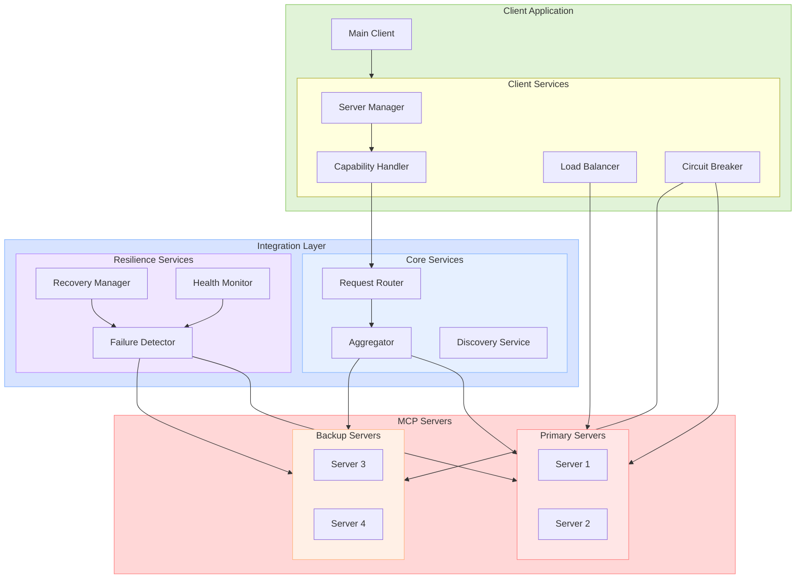
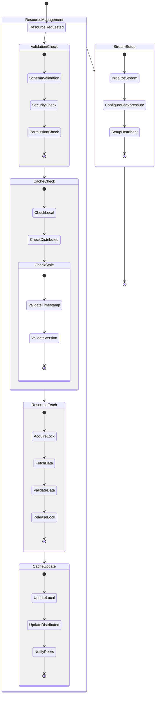
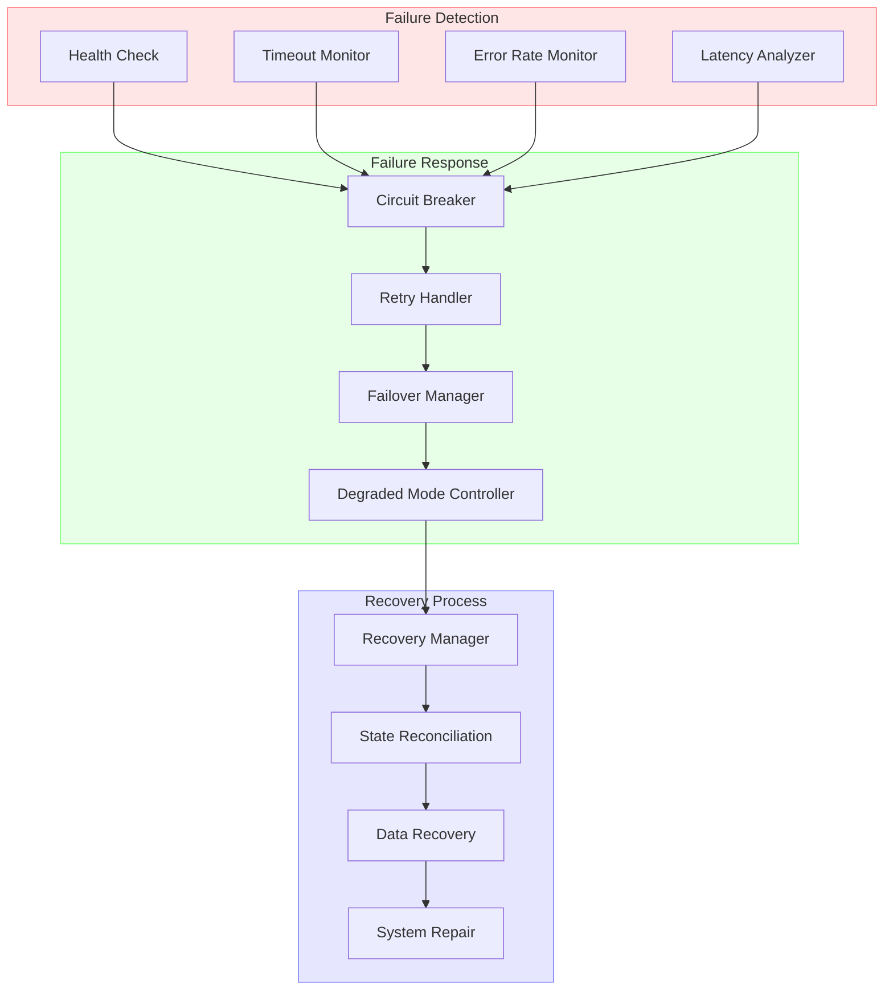
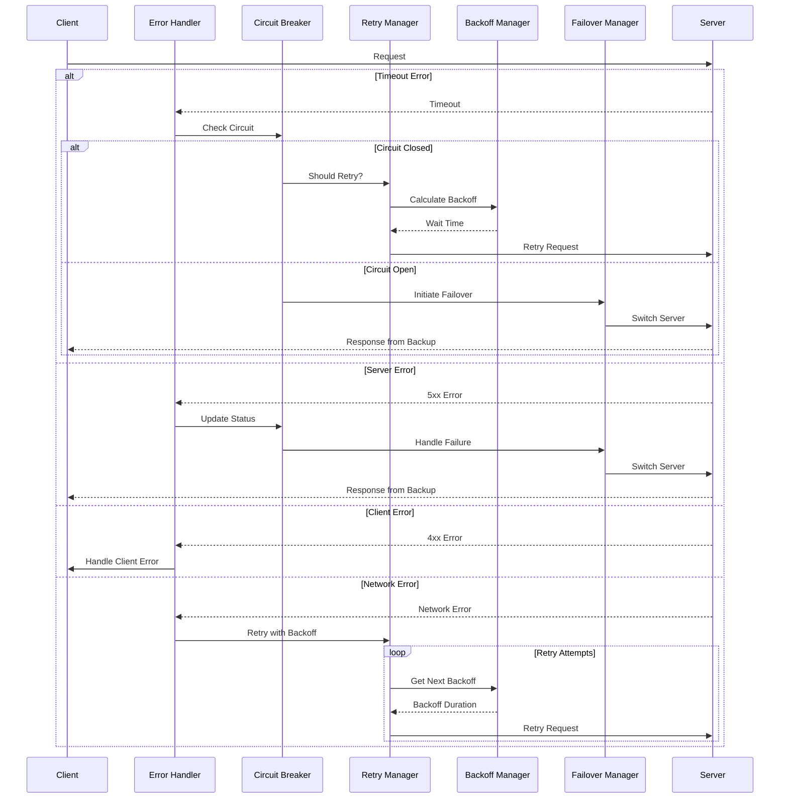

# MCP Integration Patterns

## Multi-Server Architecture

```mermaid
graph TB
    subgraph Client ["Client Application"]
        direction TB
        MC[Main Client]
        subgraph ClientServices ["Client Services"]
            direction LR
            SM[Server Manager]
            CH[Capability Handler]
            LB[Load Balancer]
            CB[Circuit Breaker]
        end
    end

    subgraph Servers ["MCP Servers"]
        direction TB
        subgraph Primary ["Primary Servers"]
            S1[Server 1]
            S2[Server 2]
        end
        subgraph Backup ["Backup Servers"]
            S3[Server 3]
            S4[Server 4]
        end
    end

    subgraph Integration ["Integration Layer"]
        direction TB
        subgraph Core ["Core Services"]
            AG[Aggregator]
            RR[Request Router]
            DI[Discovery Service]
        end
        subgraph Resilience ["Resilience Services"]
            FD[Failure Detector]
            RM[Recovery Manager]
            HM[Health Monitor]
        end
    end

    MC --> ClientServices
    SM --> CH
    CH --> RR
    RR --> AG
    
    AG --> Primary
    AG --> Backup
    
    LB --> Primary
    CB --> Primary
    CB --> Backup
    
    FD --> Primary
    FD --> Backup
    RM --> FD
    HM --> FD

    style Client fill:#e1f3d8,stroke:#82c458
    style Servers fill:#ffd7d7,stroke:#ff8080
    style Integration fill:#d7e3ff,stroke:#80b3ff
    style Primary fill:#ffe6e6,stroke:#ff8080
    style Backup fill:#fff0e6,stroke:#ffb380
    style Core fill:#e6f0ff,stroke:#80b3ff
    style Resilience fill:#f0e6ff,stroke:#b380ff
```

## Advanced Resource Management

```mermaid
stateDiagram-v2
    [*] --> ResourceRequested
    
    state ResourceManagement {
        ResourceRequested --> ValidationCheck
        
        state ValidationCheck {
            [*] --> SchemaValidation
            SchemaValidation --> SecurityCheck
            SecurityCheck --> PermissionCheck
            PermissionCheck --> [*]
        }
        
        ValidationCheck --> CacheCheck
        
        state CacheCheck {
            [*] --> CheckLocal
            CheckLocal --> CheckDistributed
            CheckDistributed --> CheckStale
            
            state CheckStale {
                [*] --> ValidateTimestamp
                ValidateTimestamp --> ValidateVersion
                ValidateVersion --> [*]
            }
        }
        
        CacheCheck --> ResourceFetch
        
        state ResourceFetch {
            [*] --> AcquireLock
            AcquireLock --> FetchData
            FetchData --> ValidateData
            ValidateData --> ReleaseLock
            ReleaseLock --> [*]
        }
        
        ResourceFetch --> CacheUpdate
        
        state CacheUpdate {
            [*] --> UpdateLocal
            UpdateLocal --> UpdateDistributed
            UpdateDistributed --> NotifyPeers
            NotifyPeers --> [*]
        }
    }
    
    ResourceManagement --> StreamSetup
    
    state StreamSetup {
        [*] --> InitializeStream
        InitializeStream --> ConfigureBackpressure
        ConfigureBackpressure --> SetupHeartbeat
        SetupHeartbeat --> [*]
    }
    
    StreamSetup --> [*]
```

## Resilience Patterns

```mermaid
flowchart TD
    subgraph Detection ["Failure Detection"]
        direction TB
        HC[Health Check]
        TO[Timeout Monitor]
        ER[Error Rate Monitor]
        LA[Latency Analyzer]
    end

    subgraph Response ["Failure Response"]
        direction TB
        CB[Circuit Breaker]
        RT[Retry Handler]
        FO[Failover Manager]
        DC[Degraded Mode Controller]
    end

    subgraph Recovery ["Recovery Process"]
        direction TB
        RM[Recovery Manager]
        SR[State Reconciliation]
        DR[Data Recovery]
        SY[System Repair]
    end

    HC --> CB
    TO --> CB
    ER --> CB
    LA --> CB
    
    CB --> RT
    RT --> FO
    FO --> DC
    
    DC --> RM
    RM --> SR
    SR --> DR
    DR --> SY
    
    style Detection fill:#ffe6e6,stroke:#ff8080
    style Response fill:#e6ffe6,stroke:#80ff80
    style Recovery fill:#e6e6ff,stroke:#8080ff
```

## Error Handling Strategy

```mermaid
sequenceDiagram
    participant C as Client
    participant EH as Error Handler
    participant CB as Circuit Breaker
    participant R as Retry Manager
    participant B as Backoff Manager
    participant F as Failover Manager
    participant S as Server

    C->>S: Request
    
    alt Timeout Error
        S-->>EH: Timeout
        EH->>CB: Check Circuit
        
        alt Circuit Closed
            CB->>R: Should Retry?
            R->>B: Calculate Backoff
            B-->>R: Wait Time
            R->>S: Retry Request
        else Circuit Open
            CB->>F: Initiate Failover
            F->>S: Switch Server
            S-->>C: Response from Backup
        end
        
    else Server Error
        S-->>EH: 5xx Error
        EH->>CB: Update Status
        CB->>F: Handle Failure
        F->>S: Switch Server
        S-->>C: Response from Backup
        
    else Client Error
        S-->>EH: 4xx Error
        EH->>C: Handle Client Error
        
    else Network Error
        S-->>EH: Network Error
        EH->>R: Retry with Backoff
        loop Retry Attempts
            R->>B: Get Next Backoff
            B-->>R: Backoff Duration
            R->>S: Retry Request
        end
    end
``` 