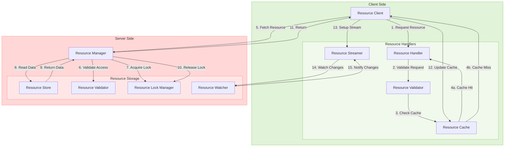
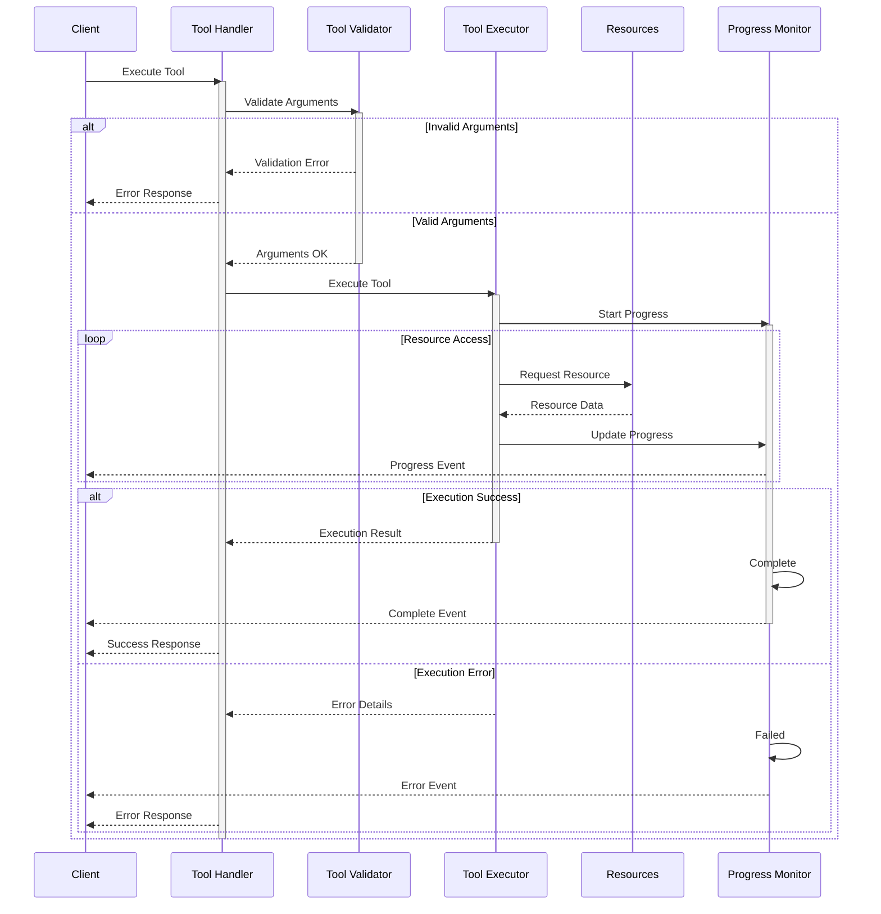
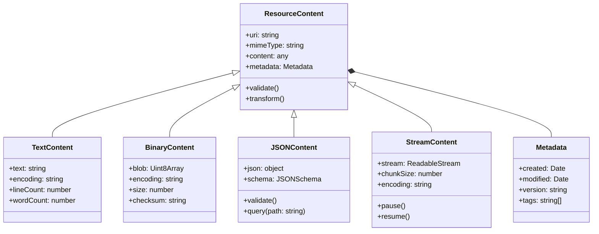
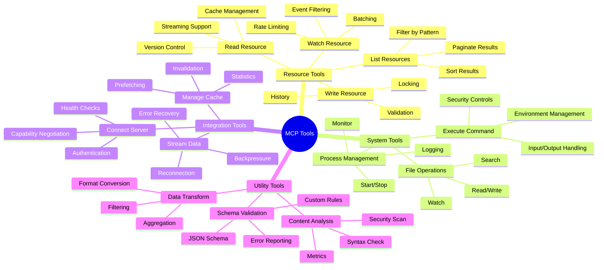

# MCP Resource and Tool Flows

## Resource Management Flow

```mermaid
flowchart TD
    subgraph Client ["Client Side"]
        direction TB
        RC[Resource Client]
        subgraph Handlers ["Resource Handlers"]
            direction LR
            RH[Resource Handler]
            Cache[Resource Cache]
            Stream[Resource Streamer]
            Val[Resource Validator]
        end
    end

    subgraph Server ["Server Side"]
        direction TB
        RM[Resource Manager]
        subgraph Storage ["Resource Storage"]
            direction LR
            RS[Resource Store]
            RV[Resource Validator]
            RL[Resource Lock Manager]
            RW[Resource Watcher]
        end
    end

    RC -->|1. Request Resource| RH
    RH -->|2. Validate Request| Val
    Val -->|3. Check Cache| Cache
    
    Cache -->|4a. Cache Hit| RH
    Cache -->|4b. Cache Miss| RC
    
    RC -->|5. Fetch Resource| RM
    RM -->|6. Validate Access| RV
    RM -->|7. Acquire Lock| RL
    RM -->|8. Read Data| RS
    RS -->|9. Return Data| RM
    RM -->|10. Release Lock| RL
    RM -->|11. Return| RC
    
    RC -->|12. Update Cache| Cache
    RC -->|13. Setup Stream| Stream
    Stream -->|14. Watch Changes| RW
    RW -->|15. Notify Changes| Stream

    style Client fill:#e1f3d8,stroke:#82c458
    style Server fill:#ffd7d7,stroke:#ff8080
    style Handlers fill:#f0f9eb,stroke:#82c458
    style Storage fill:#ffe6e6,stroke:#ff8080
```

## Tool Execution Flow

```mermaid
sequenceDiagram
    participant C as Client
    participant TH as Tool Handler
    participant TV as Tool Validator
    participant TE as Tool Executor
    participant R as Resources
    participant P as Progress Monitor

    C->>TH: Execute Tool
    activate TH
    
    TH->>TV: Validate Arguments
    activate TV
    
    alt Invalid Arguments
        TV-->>TH: Validation Error
        TH-->>C: Error Response
    else Valid Arguments
        TV-->>TH: Arguments OK
        deactivate TV
        
        TH->>TE: Execute Tool
        activate TE
        
        TE->>P: Start Progress
        activate P
        
        loop Resource Access
            TE->>R: Request Resource
            R-->>TE: Resource Data
            TE->>P: Update Progress
            P-->>C: Progress Event
        end
        
        alt Execution Success
            TE-->>TH: Execution Result
            deactivate TE
            P->>P: Complete
            P-->>C: Complete Event
            deactivate P
            TH-->>C: Success Response
        else Execution Error
            TE-->>TH: Error Details
            P->>P: Failed
            P-->>C: Error Event
            TH-->>C: Error Response
        end
    end
    deactivate TH
```

## Resource Content Types

```mermaid
classDiagram
    class ResourceContent {
        +uri: string
        +mimeType: string
        +content: any
        +metadata: Metadata
        +validate()
        +transform()
    }

    class TextContent {
        +text: string
        +encoding: string
        +lineCount: number
        +wordCount: number
    }

    class BinaryContent {
        +blob: Uint8Array
        +encoding: string
        +size: number
        +checksum: string
    }

    class JSONContent {
        +json: object
        +schema: JSONSchema
        +validate()
        +query(path: string)
    }

    class StreamContent {
        +stream: ReadableStream
        +chunkSize: number
        +encoding: string
        +pause()
        +resume()
    }

    class Metadata {
        +created: Date
        +modified: Date
        +version: string
        +tags: string[]
    }

    ResourceContent <|-- TextContent
    ResourceContent <|-- BinaryContent
    ResourceContent <|-- JSONContent
    ResourceContent <|-- StreamContent
    ResourceContent *-- Metadata
```

## Tool Categories and Relationships

```mermaid
mindmap
    root((MCP Tools))
        Resource Tools
            List Resources
                Filter by Pattern
                Sort Results
                Paginate Results
            Read Resource
                Cache Management
                Streaming Support
                Version Control
            Write Resource
                Validation
                Locking
                History
            Watch Resource
                Event Filtering
                Rate Limiting
                Batching
        System Tools
            Execute Command
                Input/Output Handling
                Environment Management
                Security Controls
            File Operations
                Read/Write
                Search
                Watch
            Process Management
                Start/Stop
                Monitor
                Logging
        Integration Tools
            Connect Server
                Authentication
                Capability Negotiation
                Health Checks
            Manage Cache
                Invalidation
                Prefetching
                Statistics
            Stream Data
                Backpressure
                Error Recovery
                Reconnection
        Utility Tools
            Schema Validation
                JSON Schema
                Custom Rules
                Error Reporting
            Data Transform
                Format Conversion
                Filtering
                Aggregation
            Content Analysis
                Syntax Check
                Security Scan
                Metrics
``` 