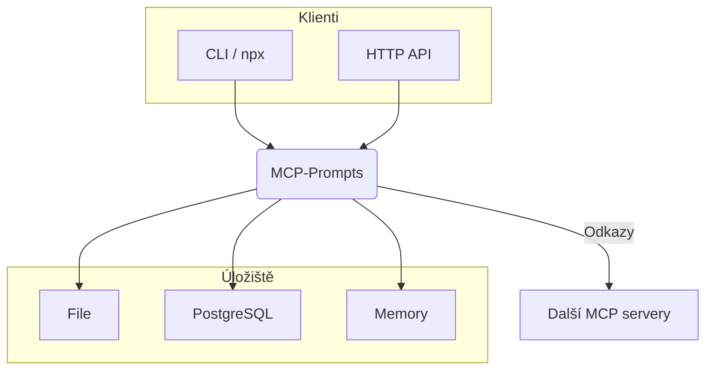

# MCP-Prompts – Přehled (CZ)

MCP-Prompts je lehký server postavený na _Model Context Protocolu (MCP)_, který slouží jako centrální knihovna promptů, šablon a sekvencí pro AI nástroje.

## Klíčové vlastnosti

| 🔑 Funkce               | Popis                                                     |
| ----------------------- | --------------------------------------------------------- |
| Centralizované úložiště | Jeden zdroj pravdy pro všechny prompty a šablony.         |
| Šablony + proměnné      | Server nahrazuje `{{variables}}`, hlídá validitu a verze. |
| Více úložišť            | File, PostgreSQL, In-Memory – přepínatelné konfigem.      |
| Integrovatelné zdroje   | Odkazy na jiné MCP servery (`@github://`, `@file://` …).  |
| CLI & HTTP API          | Rychlý přístup z terminálu i aplikací.                    |
| Sekvence & Workflow     | Definujte pořadí promptů, brzy i podmíněné kroky.         |

## Rychlá architektura

## Jak začít

1. `npm i -g @sparesparrow/mcp-prompts` **nebo** `docker run sparesparrow/mcp-prompts`
2. Otevřete `http://localhost:3003/health` – měli byste vidět `OK`.
3. Přidejte první prompt: `mcp-prompts add ./my-prompt.json`

> Podrobnější návody: [Quick-Start](01-quickstart.md) / [API Reference](04-api-reference.md)
