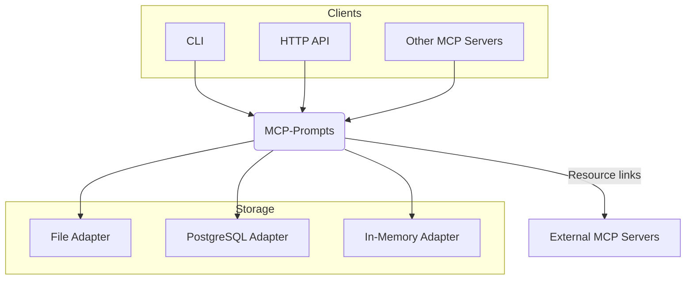

# MCP-Prompts – Quick Overview

MCP-Prompts je **MCP server**, který ukládá a doručuje prompty, šablony a nyní i sekvence/workflow pro AI klienty.

## Why use it?

* 📚 Centralizované úložiště promptů a šablon
* 🔄 Verzování + validace JSON schématem
* 🧩 Více backendů – File / PostgreSQL / In-Memory (+ další)
* 🔗 Integrace s ostatními MCP servery (filesystem, GitHub, memory…)
* ⚡ Rychlé API + CLI (`npx mcp-prompts ...`)

### Architecture at a glance

*Podrobnou dokumentaci najdete v jednotlivých souborech v `docs/` – českou verzi přehledu viz **`docs/00-overview-cs.md`**.* 