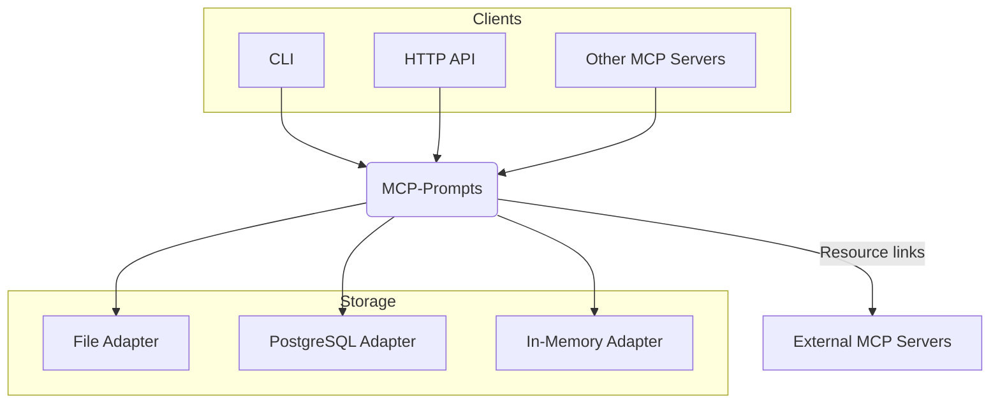

# MCP-Prompts – Overview

MCP-Prompts is a **Model Context Protocol (MCP) server** for managing, versioning, and delivering prompts, templates, and multi-step workflows to AI clients.

## Purpose

- 📚 Centralized prompt and template storage
- 🔄 Versioning & JSON schema validation
- 🧩 Multiple backends: File / PostgreSQL / In-Memory / (planned: MDC, ElasticSearch)
- 🔗 Integration with other MCP servers (filesystem, GitHub, memory, ...)
- ⚡ Fast HTTP API & CLI (`npx mcp-prompts ...`)
- 🏗️ Built with **hexagonal architecture** for modularity and extensibility

## What is MCP?

Model Context Protocol (MCP) is an open protocol for connecting LLM applications with external data, tools, and workflows. MCP-Prompts implements the MCP server role, exposing prompts and templates as resources and tools for AI clients. [Learn more](https://modelcontextprotocol.io/specification/draft).

## Architecture at a Glance

> **Hexagonal architecture** ensures clear separation between core logic, adapters, and transports. This makes the system easy to extend (new storage, new APIs) and test.

---

## Documentation Map

- [Quickstart](01-quickstart.md) – Get started in 5 minutes
- [Configuration](02-configuration.md) – All environment variables
- [Storage Adapters](03-storage-adapters.md) – Backend options
- [API Reference](04-api-reference.md) – HTTP endpoints
- [Templates Guide](05-templates-guide.md) – Using and creating templates
- [MCP Integration](06-mcp-integration.md) – Connect with other MCP servers
- [Developer Guide](07-developer-guide.md) – Contributing & development
- [Workflow Guide](09-workflow-guide.md) – Multi-step workflows
- [Research & Designs](research/) – Architecture, analyses, and roadmap

_Podrobnou dokumentaci najdete v jednotlivých souborech v `docs/` – českou verzi přehledu viz **`docs/00-overview-cs.md`**._
