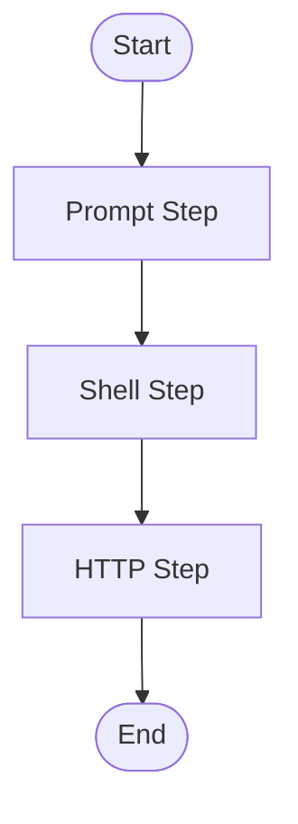

# Workflow Engine Guide

The Workflow Engine in MCP-Prompts lets you define, save, and execute multi-step workflows that combine prompts, shell commands, and HTTP requests. This enables advanced automation and orchestration for LLM applications.

> **MCP-Prompts** uses hexagonal architecture: workflow logic is part of the core domain, with adapters for storage and transport. See [Overview](00-overview.md), [Templates Guide](05-templates-guide.md), and [API Reference](04-api-reference.md) for details.

## Overview

The MCP-Prompts Workflow Engine lets you define, save, and execute multi-step workflows that combine prompt templates, shell commands, and HTTP requests. Workflows can be run via API or CLI, with shared variables and outputs between steps.

## Workflow Schema

A workflow is a JSON object with:

- `id`: Unique workflow ID
- `name`: Human-readable name
- `version`: Schema version (number)
- `variables`: (optional) Key-value pairs for workflow-wide variables
- `steps`: Array of step objects (see below)

### Step Types

Each step has:

- `id`: Unique step ID
- `type`: One of `prompt`, `shell`, `http`
- `output`: Name for the output variable
- Additional fields per type:
  - **prompt**: `promptId`, `input` (object)
  - **shell**: `command` (string)
  - **http**: `method` (GET/POST/PUT/DELETE/PATCH), `url`, `body` (optional)

### Example Workflow

```json
{
  "id": "sample-workflow",
  "name": "Sample Workflow",
  "version": 1,
  "variables": { "greeting": "Hello, world!" },
  "steps": [
    {
      "id": "prompt_step",
      "type": "prompt",
      "promptId": "basic-template",
      "input": { "text": "{{ greeting }}" },
      "output": "promptResult"
    },
    {
      "id": "shell_step",
      "type": "shell",
      "command": "echo 'Shell step executed'",
      "output": "shellResult"
    },
    {
      "id": "http_step",
      "type": "http",
      "method": "GET",
      "url": "https://httpbin.org/get",
      "output": "httpResult"
    }
  ]
}
```

## Execution Flow



## Running Workflows

- **API:**
  - `POST /api/v1/workflows/run` (ad-hoc)
  - `POST /api/v1/workflows` (save)
  - `GET /api/v1/workflows/:id` (get)
  - `POST /api/v1/workflows/:id/run` (run saved)
- **CLI:**
  - `mcp-prompts workflow run <file.json>`
  - `mcp-prompts workflow save <file.json>`
  - `mcp-prompts workflow run <id>`

## Variables & Outputs

- Use `variables` for workflow-wide values.
- Each step can output a value to the shared context, referenced by later steps as `{{ context.outputName }}`.

## Security & Limits

- **Shell steps**: Not sandboxed by default; use Docker or non-root for production.
- **Timeouts**: Each step has a 60s default timeout.
- **Rate limiting**: 3 concurrent workflows per user (429 error if exceeded).
- **Audit log**: All runs are logged to `logs/workflow-audit.log`.

## Troubleshooting

- Check the audit log for run history and errors.
- 429 errors mean you hit the concurrency limit.
- 400/404 errors indicate invalid or missing workflows.

For more, see the main README and API reference.
