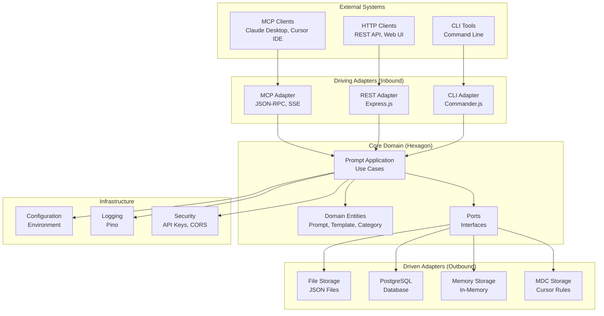
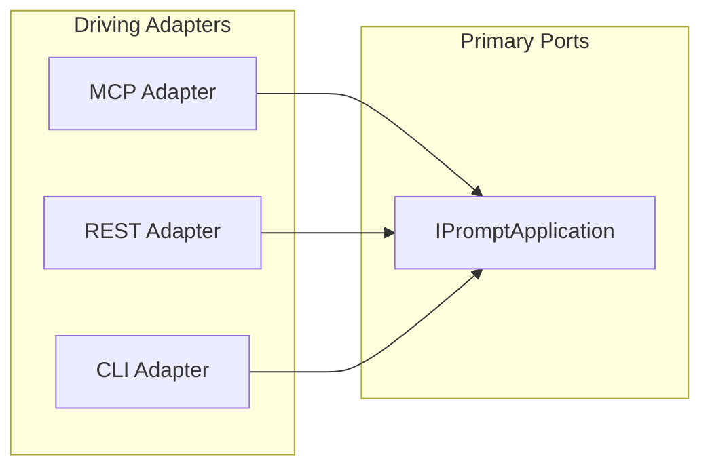
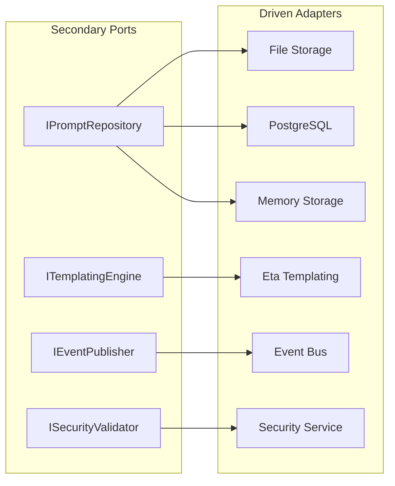
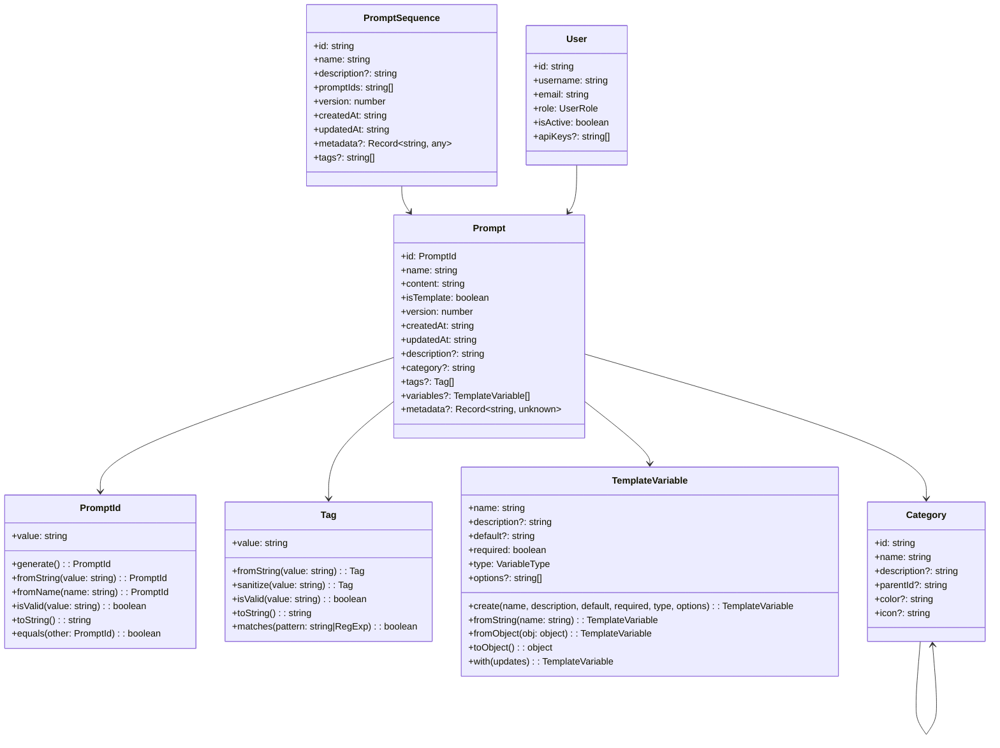
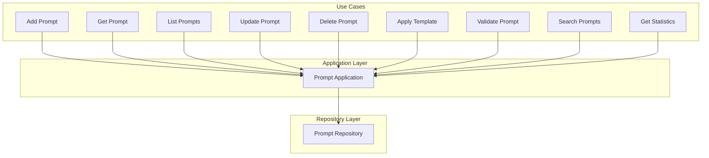
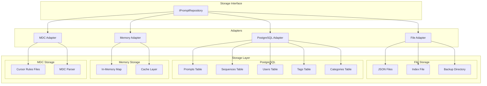
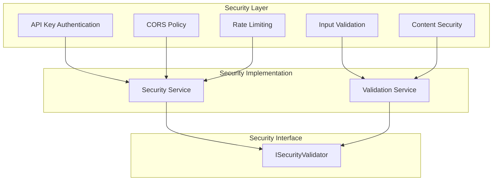
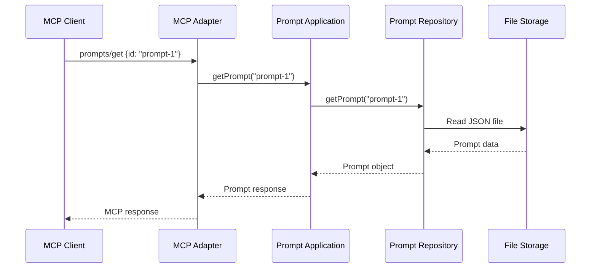
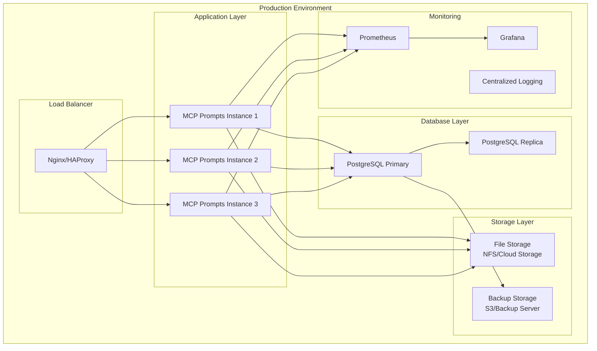
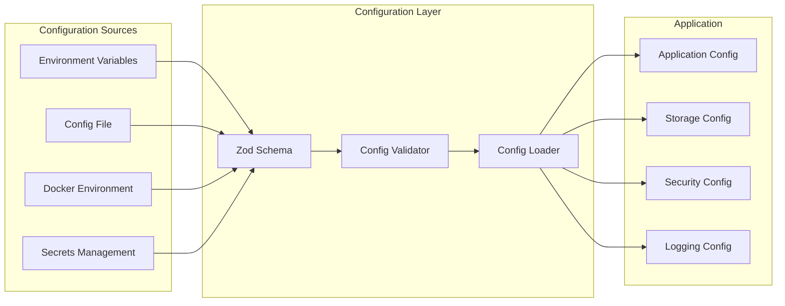

# MCP Prompts Server Architecture

## Overview

MCP Prompts Server follows **Hexagonal Architecture** (Ports & Adapters) principles, providing a clean separation between domain logic and infrastructure concerns.

## 🏗️ High-Level Architecture

## 🔌 Ports & Adapters

### Primary Ports (Driving)

### Secondary Ports (Driven)

## 🏛️ Domain Model

## 🔄 Use Cases

## 🗄️ Storage Architecture

## 🔐 Security Architecture

## 📊 Data Flow

## 🚀 Deployment Architecture

## 🔧 Configuration Management

## 📈 Performance Considerations

- **Caching**: In-memory caching for frequently accessed prompts
- **Indexing**: JSON index files for fast prompt discovery
- **Lazy Loading**: Load prompt content only when needed
- **Batch Operations**: Bulk import/export operations
- **Connection Pooling**: Database connection management
- **Async Operations**: Non-blocking I/O operations

## 🔒 Security Considerations

- **API Key Authentication**: Secure access control
- **Input Validation**: Zod schema validation
- **Content Security**: Sanitization of prompt content
- **Rate Limiting**: Protection against abuse
- **CORS Policy**: Cross-origin request control
- **Audit Logging**: Track all operations

## 🧪 Testing Strategy

- **Unit Tests**: Test individual use cases and entities
- **Integration Tests**: Test adapter implementations
- **E2E Tests**: Test complete workflows
- **Performance Tests**: Load testing and benchmarking
- **Security Tests**: Vulnerability scanning and penetration testing

## 📚 References

- [Hexagonal Architecture](https://alistair.cockburn.us/hexagonal-architecture/)
- [Model Context Protocol](https://modelcontextprotocol.io/)
- [Clean Architecture](https://blog.cleancoder.com/uncle-bob/2012/08/13/the-clean-architecture.html)
- [Domain-Driven Design](https://domainlanguage.com/ddd/)
