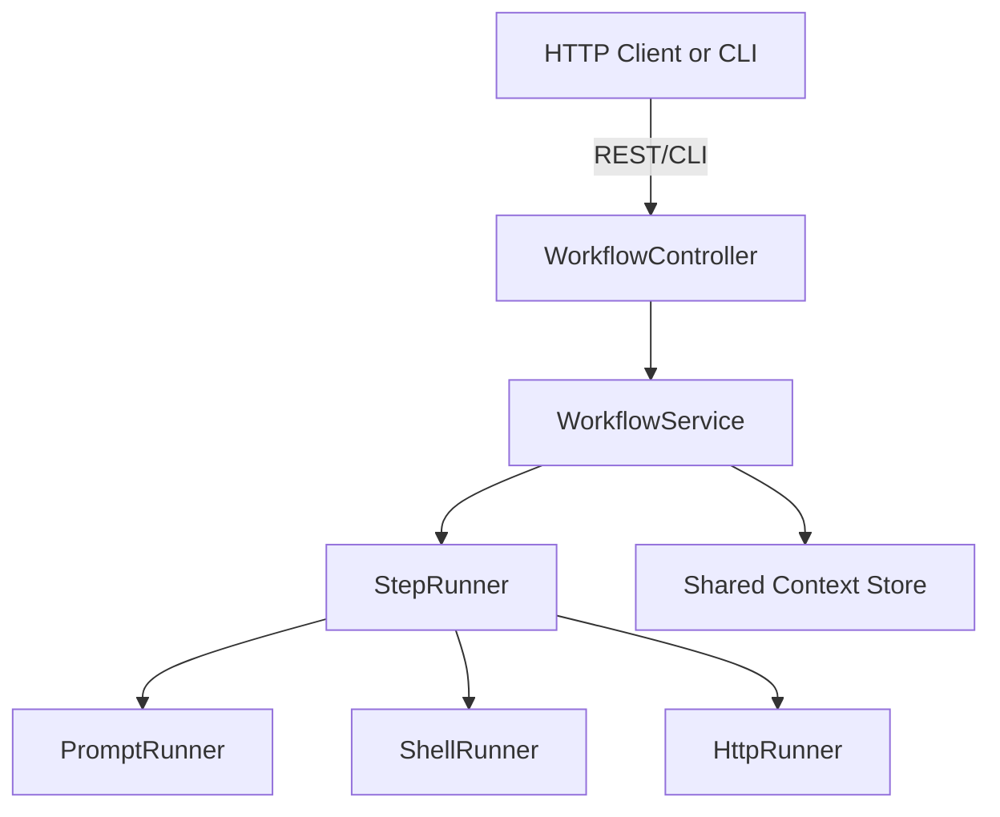

# MCP-Prompts – Workflow Engine: Technický návrh

> Stav dokumentu: _Draft v0.1_ • Autoři: Tým MCP-Prompts • Datum: 2025-05-15

## 1 Motivace a cíle

Současný server MCP-Prompts ukládá a distribuuje jednotlivé prompty. Uživatelé však často potřebují spouštět několik promptů v přesně definovaném sledu ("řetězení") a navázat na jejich výstupy dalšími kroky. Cílem Workflow Enginu je poskytnout:

* deklarativní popis workflow (YAML/JSON)
* deterministické a opakovatelné spouštění sekvencí (`PromptSequence`)
* předávání dat mezi kroky (context object)
* extensibilní kroky (volání externích MCP serverů, shell příkazů apod.)
* plnohodnotné API + CLI podporu
* možnost paralelizace (v budoucnu)

> **Why this matters:**
> - Umožňuje automatizovat komplexní AI workflow.
> - Sdílení a opakované použití workflow mezi týmy.
> - Lepší auditovatelnost a správa promptů i workflow.

## 2 Základní koncepty

| Pojem            | Popis                                                                                                               |
|------------------|----------------------------------------------------------------------------------------------------------------------|
| **Workflow**     | Kořenový objekt, který popisuje celý proces, jeho kroky a sdílený kontext.                                           |
| **Step**         | Jednotlivá akce v rámci workflow (vyvolání promptu, shell, HTTP request…).                                           |
| **Input**        | Vstupní data kroku – mohou pocházet z konstant, env, nebo výstupu předchozího kroku.                                 |
| **Output**       | Výstup kroku – ukládá se do shared context pod zadaným klíčem.                                                        |
| **Condition**    | (volitelné) podmínka, zda krok vykonat (`expression` evaluovaná nad contextem).                                      |
| **ErrorPolicy**  | Strategie při chybě (`continue`, `skip`, `abort`, `retry<n>`).                                                       |

> **Tip:** Kontext (`context`) je sdílený objekt, do kterého každý krok ukládá svůj výstup. Další kroky mohou tento výstup použít jako vstup.

## 3 Formát definice (`workflow.yaml`)

```yaml
id: generate-release
name: Release Notes Generator
version: 1

# Proměnné použitelné v celém workflow
variables:
  repo: modelcontextprotocol/mcp-prompts
  tag: v1.3.0

steps:
  - id: fetch_commits
    type: prompt
    promptId: repository-explorer
    input:
      owner: "{{ repo.split('/')![0] }}"
      repo_name: "{{ repo.split('/')![1] }}"
      since_tag: "{{ tag }}"
    output: commits

  - id: summarize
    type: prompt
    promptId: sequential-data-analysis
    input:
      data_type: commits
      data_sample: "{{ context.commits }}"
    output: release_notes

  - id: write_file
    type: shell
    command: "echo '{{ context.release_notes }}' > RELEASE_NOTES.md"
```

### 3.1 Podporované typy kroků (MVP)

* `prompt` – spuštění existujícího promptu z MCP-Prompts
* `shell` – spuštění shell příkazu (běží v sandboxu serveru)
* `http` – volání HTTP metody (GET/POST…)

> **Příklad:**
> - Prompt krok získá data z repozitáře.
> - Další prompt krok data shrne.
> - Shell krok výsledek uloží do souboru.

## 4 Architektura



- **WorkflowController:** REST endpointy pro spouštění a správu workflow.
- **WorkflowService:** Parsování, validace a orchestrace kroků.
- **StepRunner:** Strategický pattern pro různé typy kroků.
- **Context Store:** Sdílený objekt pro předávání dat mezi kroky.

## 5 API rozhraní (MVP)

| Metoda | URL | Popis |
|--------|-----|-------|
| `POST` | `/api/v1/workflows/run` | Spustit ad-hoc workflow (tělo = definice) |
| `POST` | `/api/v1/workflows`     | Uložit workflow definici |
| `GET`  | `/api/v1/workflows/:id` | Detail uloženého workflow |
| `POST` | `/api/v1/workflows/:id/run` | Spustit uložený workflow |

## 6 CLI integrace

Nové příkazy:

```bash
mcp-prompts workflow run ./release.yaml      # ad-hoc
mcp-prompts workflow save ./release.yaml     # uložit
mcp-prompts workflow run saved-id            # spustit uložený
```

## 7 Validace & schéma

* JSON Schema `workflow.schema.json` bude publikováno v `src/schemas.ts`.
* `npm run validate:workflow <file>` provede validaci (rozšíříme `validate-json.ts`).

## 8 Bezpečnostní a výkonové aspekty

* **Sandbox** – shell kroky běží s omezenými oprávněními (Docker exec nebo child_process bez root).
* **Timeout** – implicitní limit (např. 60 s) na krok.
* **Rate limit** – omezení paralelních workflow pro jednoho uživatele.
* **Audit log** – zaznamenáme spuštění a výsledky.

## 9 Budoucí rozšíření

* Paralelní kroky (`dependsOn`, `runAfter`)
* Stavový stroj a vizualizace dag-u
* UI v Claude Desktop / Web konzole
* Pokročilé condition expression (`jq`, `JMESPath`)
* Integrace s externími frontami (Redis, BullMQ)

## 10 Otevřené otázky

1. Serializace velkých výstupů (uložit jen hash vs. celá data?)
2. Mechanismus `secrets` pro shell & http kroky
3. Distribuované běhy (sharding, worker pool)

---

# MVP Implementation Roadmap

> **For up-to-date progress, see the TODO section in the main README.**

1. **Schema & Validation**
   - [ ] Finalizovat a publikovat `workflow.schema.json` v `src/schemas.ts`.
   - [ ] Rozšířit `validate-json.ts` o validaci workflow (`npm run validate:workflow <file>`).

2. **Core Engine**
   - [ ] Implementovat `WorkflowService` pro parsování, validaci a orchestraci workflow.
   - [ ] Implementovat strategii `StepRunner` pro různé typy kroků.
   - [ ] Implementovat `PromptRunner` pro prompt kroky.
   - [ ] Implementovat `ShellRunner` pro shell kroky (sandbox, timeout).
   - [ ] Implementovat `HttpRunner` pro HTTP kroky.
   - [ ] Přidat sdílený in-memory context store pro předávání dat mezi kroky.

3. **API Endpoints**
   - [ ] Přidat REST endpoint: `POST /api/v1/workflows/run` (ad-hoc spuštění).
   - [ ] Přidat REST endpoint: `POST /api/v1/workflows` (uložení definice).
   - [ ] Přidat REST endpoint: `GET /api/v1/workflows/:id` (získání definice).
   - [ ] Přidat REST endpoint: `POST /api/v1/workflows/:id/run` (spuštění uloženého workflow).

4. **CLI Integrace**
   - [ ] Přidat CLI příkaz: `mcp-prompts workflow run <file>` (ad-hoc run).
   - [ ] Přidat CLI příkaz: `mcp-prompts workflow save <file>` (uložení workflow).
   - [ ] Přidat CLI příkaz: `mcp-prompts workflow run <id>` (spuštění uloženého workflow).

5. **Bezpečnost & Výkon**
   - [ ] Implementovat sandboxing pro shell kroky (např. Docker exec, bez root).
   - [ ] Přidat timeout pro každý krok (default 60s).
   - [ ] Přidat rate limiting pro paralelní workflow na uživatele.
   - [ ] Implementovat audit logování běhů a výsledků.

6. **Dokumentace & Příklady**
   - [ ] Přidat uživatelské a vývojářské návody pro workflow.
   - [ ] Přidat ukázkové workflow YAML/JSON soubory.
   - [ ] Přidat vizuální diagramy do dokumentace a README.

7. **Testování**
   - [ ] Přidat integrační testy pro workflow engine a typy kroků.

8. **Budoucí rozšíření (po MVP)**
   - [ ] Podpora paralelních kroků (`dependsOn`, `runAfter`).
   - [ ] Vizualizace DAG/stavového stroje.
   - [ ] Integrace s UI (Claude Desktop, web konzole).
   - [ ] Pokročilé podmínky (`jq`, `JMESPath`).
   - [ ] Distribuované běhy (worker pool, sharding).

---

_Diskusi nad dokumentem prosím otevírejte v Issues nebo komunikujte na Slacku #mcp-prompts._ 