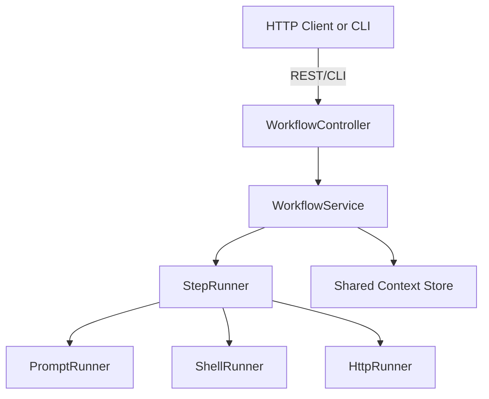

# MCP Prompts Workflow Engine: Technical Design

> **Status**: _Draft v0.2_ • **Authors**: MCP Prompts Team • **Date**: 2025-01-20

## 🎯 **Motivation & Goals**

The current MCP Prompts server stores and distributes individual prompts. However, users often need to execute multiple prompts in a precisely defined sequence ("chaining") and build upon their outputs with additional steps. The Workflow Engine aims to provide:

- **Declarative workflow description** (YAML/JSON)
- **Deterministic and repeatable execution** of sequences (`PromptSequence`)
- **Data passing between steps** (context object)
- **Extensible steps** (calling external MCP servers, shell commands, etc.)
- **Full API + CLI support**
- **Parallelization capabilities** (future enhancement)

> **Why this matters:**
> - Enables automation of complex AI workflows
> - Sharing and reusing workflows between teams
> - Better auditability and management of prompts and workflows

## 🏗️ **Core Concepts**

| Concept | Description |
|---------|-------------|
| **Workflow** | Root object describing the entire process, its steps, and shared context |
| **Step** | Individual action within a workflow (prompt invocation, shell, HTTP request, etc.) |
| **Input** | Step input data - can come from constants, environment, or previous step outputs |
| **Output** | Step output - stored in shared context under specified key |
| **Condition** | (Optional) condition determining whether to execute step (`expression` evaluated over context) |
| **ErrorPolicy** | Strategy on error (`continue`, `skip`, `abort`, `retry<n>`) |

> **Tip**: Context is a shared object where each step stores its output. Subsequent steps can use this output as input.

## 📝 **Definition Format (`workflow.yaml`)**

```yaml
id: generate-release
name: Release Notes Generator
version: 1

# Variables usable throughout the workflow
variables:
  repo: modelcontextprotocol/mcp-prompts
  tag: v1.3.0

steps:
  - id: fetch_commits
    type: prompt
    promptId: repository-explorer
    input:
      owner: "{{ repo.split('/')[0] }}"
      repo_name: "{{ repo.split('/')[1] }}"
      since_tag: '{{ tag }}'
    output: commits

  - id: summarize
    type: prompt
    promptId: sequential-data-analysis
    input:
      data_type: commits
      data_sample: '{{ context.commits }}'
    output: release_notes

  - id: write_file
    type: shell
    command: "echo '{{ context.release_notes }}' > RELEASE_NOTES.md"
```

### **3.1 Supported Step Types (MVP)**

- `prompt` – Execute existing prompt from MCP Prompts
- `shell` – Execute shell command (runs in server sandbox)
- `http` – Make HTTP request (GET/POST, etc.)

> **Example Flow:**
> - Prompt step fetches data from repository
> - Next prompt step summarizes the data
> - Shell step saves result to file

## 🏛️ **Architecture**



- **WorkflowController**: REST endpoints for workflow execution and management
- **WorkflowService**: Parsing, validation, and step orchestration
- **StepRunner**: Strategy pattern for different step types
- **Context Store**: Shared object for data passing between steps

## 🔌 **API Interface (MVP)**

### **Workflow Management**

```typescript
// Create workflow
POST /api/workflows
{
  "id": "generate-release",
  "name": "Release Notes Generator",
  "steps": [...]
}

// Execute workflow
POST /api/workflows/{id}/execute
{
  "variables": {
    "repo": "my-org/my-repo",
    "tag": "v2.0.0"
  }
}

// Get workflow status
GET /api/workflows/{id}/status
```

### **Step Types**

#### **Prompt Step**
```yaml
- id: analyze_code
  type: prompt
  promptId: code-review-assistant
  input:
    code: "{{ context.source_code }}"
    language: "{{ context.language }}"
  output: analysis_result
  errorPolicy: continue
```

#### **Shell Step**
```yaml
- id: create_backup
  type: shell
  command: "cp {{ context.source_file }} {{ context.source_file }}.backup"
  workingDir: "/tmp"
  timeout: 30
  errorPolicy: abort
```

#### **HTTP Step**
```yaml
- id: fetch_data
  type: http
  method: GET
  url: "https://api.github.com/repos/{{ context.repo }}/commits"
  headers:
    Authorization: "Bearer {{ env.GITHUB_TOKEN }}"
  output: github_data
```

## 🔄 **Context Management**

### **Context Object Structure**
```typescript
interface WorkflowContext {
  // Input variables
  variables: Record<string, any>;
  
  // Step outputs
  outputs: Record<string, any>;
  
  // Environment variables
  env: Record<string, string>;
  
  // Metadata
  metadata: {
    workflowId: string;
    executionId: string;
    startTime: Date;
    currentStep: string;
  };
}
```

### **Data Passing Between Steps**
```yaml
steps:
  - id: step1
    output: user_data
  
  - id: step2
    input:
      processed_data: "{{ context.outputs.user_data | json }}"
    output: final_result
```

## 🚦 **Error Handling & Policies**

### **Error Policy Options**
- `continue` - Skip failed step, continue with next
- `skip` - Skip failed step and mark as skipped
- `abort` - Stop workflow execution immediately
- `retry<n>` - Retry step up to n times before failing

### **Error Handling Example**
```yaml
steps:
  - id: critical_step
    type: prompt
    promptId: data-validation
    errorPolicy: retry<3>
    
  - id: optional_step
    type: shell
    command: "echo 'Optional operation'"
    errorPolicy: skip
```

## 🔒 **Security & Sandboxing**

### **Shell Command Sandboxing**
- Restricted working directory
- Timeout limits
- Command whitelisting (future)
- Resource usage limits

### **HTTP Request Security**
- URL validation and whitelisting
- Rate limiting
- Request size limits
- Header sanitization

## 📊 **Monitoring & Observability**

### **Execution Metrics**
- Step execution time
- Success/failure rates
- Resource usage
- Error patterns

### **Logging**
```typescript
interface WorkflowLog {
  executionId: string;
  stepId: string;
  timestamp: Date;
  level: 'info' | 'warn' | 'error';
  message: string;
  context: Record<string, any>;
}
```

## 🚀 **Future Enhancements**

### **Phase 2: Advanced Features**
- **Parallel execution** of independent steps
- **Conditional branching** based on step outputs
- **Loop constructs** for repetitive operations
- **Sub-workflows** for modularity

### **Phase 3: Enterprise Features**
- **Workflow templates** and sharing
- **Role-based access control** for workflows
- **Scheduled execution** and cron-like functionality
- **Integration with external systems** (CI/CD, monitoring)

## 🧪 **Testing Strategy**

### **Unit Tests**
- Step type implementations
- Context management
- Error handling logic

### **Integration Tests**
- End-to-end workflow execution
- Step interaction testing
- Context persistence

### **Performance Tests**
- Large workflow execution
- Concurrent workflow handling
- Resource usage optimization

## 📚 **Implementation Plan**

### **Phase 1: Core Engine (Current)**
- [x] Basic workflow definition format
- [x] Step execution framework
- [x] Context management
- [x] Basic error handling

### **Phase 2: Enhanced Features**
- [ ] Conditional execution
- [ ] Parallel step execution
- [ ] Advanced error policies
- [ ] Performance optimization

### **Phase 3: Production Ready**
- [ ] Security hardening
- [ ] Monitoring and alerting
- [ ] Documentation and examples
- [ ] Community feedback integration

---

*This document outlines the technical design for the MCP Prompts Workflow Engine, enabling complex AI workflow automation.*
